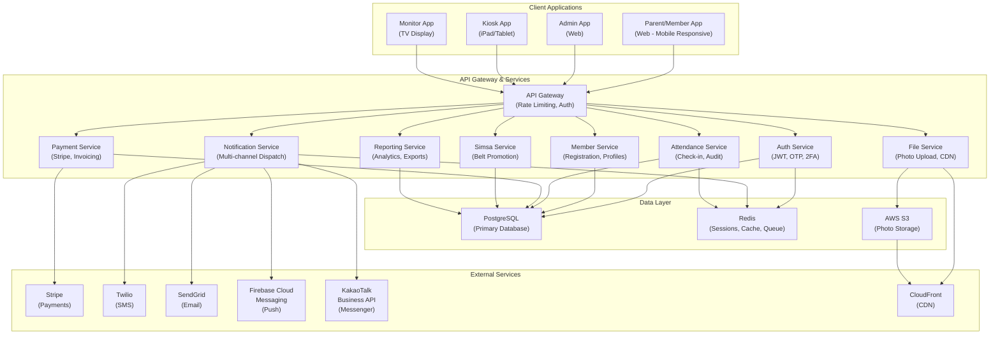

# 1. System Architecture Overview

**Related TRDs**: [02-multi-tenancy](./02-multi-tenancy.md), [03-data-model](./03-data-model.md), [04-auth](./04-auth.md), [05-api-design](./05-api-design.md)  
**Related ADRs**: [ADR-003](./adr/003-multi-tenant-architecture.md), [ADR-008](./adr/008-api-first-restful-backend.md)  
**Phase**: MVP (Phase 1)

---

### High-Level Architecture

### Service Boundaries

- **API Gateway**: Single entry point for all client applications. Handles rate limiting, request validation, and routing to backend services.
- **Auth Service**: Manages user authentication (phone OTP for parents, email + 2FA for admins), JWT token generation and validation, session management.
- **Member Service**: Handles member registration, profile management, member levels, grouping, and withdrawal workflows.
- **Attendance Service**: Manages check-in processing, audit trails, absence tracking, and alert rule evaluation.
- **Payment Service**: Integrates with Stripe for recurring billing, one-time charges, refunds, and invoice generation.
- **Notification Service**: Dispatches notifications across multiple channels (push, SMS, email, in-app, third-party messengers) with language-aware rendering.
- **Simsa Service**: Manages belt promotion exam scheduling, eligibility calculation, registration, result entry, and certificate generation.
- **Reporting Service**: Generates reports, aggregates analytics data, and exports to PDF/Excel.
- **File Service**: Handles photo uploads, storage in S3, CDN distribution, and access control.

### Tech Stack Recommendations

- **Backend**: Node.js/Express or Python/FastAPI (API-first, stateless, horizontally scalable)
- **Database**: PostgreSQL (ACID compliance, JSON support for flexible configurations, row-level security for multi-tenancy)
- **Caching/Queue**: Redis (session storage, rate limiting, async notification dispatch)
- **Frontend**: React or Vue.js (responsive web, mobile-friendly)
- **Kiosk App**: Swift (native iOS) for iPad, leveraging Apple Vision Framework and on-device ML
- **Cloud**: AWS or GCP (managed services, auto-scaling, global CDN)
- **Containerization**: Docker + Kubernetes (or ECS for AWS)
- **CI/CD**: GitHub Actions or GitLab CI

### Implementation Notes

> _This section will be updated as the feature is implemented._

- **Module location**: _TBD_
- **Key files**: _TBD_
- **Actual endpoints**: _TBD_
- **Deviations from spec**: _None yet_
- **Edge cases discovered**: _None yet_
- **Configuration**: _TBD_
