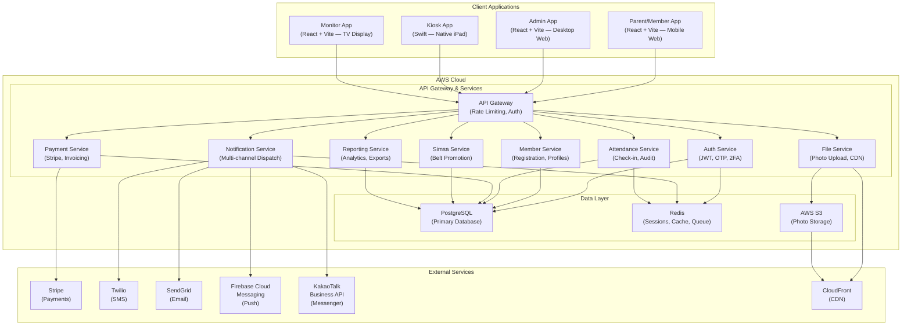

# 1. System Architecture Overview

**Related TRDs**: [02-multi-tenancy](./02-multi-tenancy.md), [03-data-model](./03-data-model.md), [04-auth](./04-auth.md), [05-api-design](./05-api-design.md), [07-web-frontend-architecture](./07-web-frontend-architecture.md), [08-kiosk-app-architecture](./08-kiosk-app-architecture.md)  
**Related ADRs**: [ADR-003](./adr/003-multi-tenant-architecture.md), [ADR-008](./adr/008-api-first-restful-backend.md), [ADR-011](./adr/011-nestjs-backend.md), [ADR-012](./adr/012-react-vite-frontend.md), [ADR-013](./adr/013-aws-cloud-platform.md), [ADR-014](./adr/014-github-actions-cicd.md), [ADR-015](./adr/015-frontend-library-stack.md)  
**Phase**: MVP (Phase 1)

---

### High-Level Architecture


```mermaid
graph TB
    subgraph "Client Applications"
        ParentApp["Parent/Member App<br/>(React + Vite — Mobile Web)"]
        AdminApp["Admin App<br/>(React + Vite — Desktop Web)"]
        KioskApp["Kiosk App<br/>(Swift — Native iPad)"]
        MonitorApp["Monitor App<br/>(React + Vite — TV Display)"]
    end

    subgraph "AWS Cloud"
        subgraph "API Gateway & Services"
            Gateway["API Gateway<br/>(Rate Limiting, Auth)"]
            AuthService["Auth Service<br/>(JWT, OTP, 2FA)"]
            MemberService["Member Service<br/>(Registration, Profiles)"]
            AttendanceService["Attendance Service<br/>(Check-in, Audit)"]
            PaymentService["Payment Service<br/>(Stripe, Invoicing)"]
            NotificationService["Notification Service<br/>(Multi-channel Dispatch)"]
            SimsaService["Simsa Service<br/>(Belt Promotion)"]
            ReportingService["Reporting Service<br/>(Analytics, Exports)"]
            FileService["File Service<br/>(Photo Upload, CDN)"]
        end

        subgraph "Data Layer"
            PostgreSQL["PostgreSQL<br/>(Primary Database)"]
            Redis["Redis<br/>(Sessions, Cache, Queue)"]
            S3["AWS S3<br/>(Photo Storage)"]
        end
    end

    subgraph "External Services"
        Stripe["Stripe<br/>(Payments)"]
        Twilio["Twilio<br/>(SMS)"]
        SendGrid["SendGrid<br/>(Email)"]
        FCM["Firebase Cloud<br/>Messaging<br/>(Push)"]
        KakaoTalk["KakaoTalk<br/>Business API<br/>(Messenger)"]
        CloudFront["CloudFront<br/>(CDN)"]
    end

    ParentApp --> Gateway
    AdminApp --> Gateway
    KioskApp --> Gateway
    MonitorApp --> Gateway

    Gateway --> AuthService
    Gateway --> MemberService
    Gateway --> AttendanceService
    Gateway --> PaymentService
    Gateway --> NotificationService
    Gateway --> SimsaService
    Gateway --> ReportingService
    Gateway --> FileService

    AuthService --> PostgreSQL
    MemberService --> PostgreSQL
    AttendanceService --> PostgreSQL
    PaymentService --> PostgreSQL
    SimsaService --> PostgreSQL
    ReportingService --> PostgreSQL
    FileService --> S3

    AuthService --> Redis
    NotificationService --> Redis
    AttendanceService --> Redis

    PaymentService --> Stripe
    NotificationService --> Twilio
    NotificationService --> SendGrid
    NotificationService --> FCM
    NotificationService --> KakaoTalk

    FileService --> CloudFront
    S3 --> CloudFront
```

### Application Architecture

Ararat consists of **5 applications** — 3 web apps, 1 native iPad app, and 1 backend API — all connected through a single RESTful API.

| Application | Platform | Primary Users | Tech Stack | Deployment | ADRs |
|-------------|----------|---------------|------------|------------|------|
| Parent/Member App | Web (mobile-responsive) | Parents, guardians, adult members | React + Vite (TypeScript) | AWS CloudFront + S3 (SPA) | [ADR-012], [ADR-015] |
| Admin App | Web (desktop-first) | Gym owner (관장님), managers, instructors | React + Vite (TypeScript) | AWS CloudFront + S3 (SPA) | [ADR-012], [ADR-015] |
| Kiosk App | iPad / Tablet (native iOS) | Children (self check-in) | Swift, Apple Vision Framework, TensorFlow Lite | Apple App Store / MDM | [ADR-004] |
| Monitor App | TV / Large Display (web) | Staff, visitors (view-only) | React + Vite (TypeScript) | AWS CloudFront + S3 (SPA) | [ADR-012] |
| Backend API | Server (containerized) | All client applications | Node.js + NestJS (TypeScript) | AWS ECS Fargate | [ADR-011], [ADR-008] |

#### Parent/Member App (Web)

Mobile-responsive SPA targeting 375px+ viewports. Uses TanStack Router with bottom tab navigation pattern (home, attendance, payments, notifications, profile). Authentication via phone OTP. Optimized for parents checking their child's gym activity on mobile devices. Detailed architecture in [TRD 07](./07-web-frontend-architecture.md).

#### Admin App (Web)

Desktop-first SPA targeting 1024px+ viewports. Uses TanStack Router with sidebar navigation for managing members, billing, 심사, reports, and gym settings. Authentication via email + 2FA (TOTP). Role-based UI surfaces — gym owner sees everything, instructors see attendance/심사 only. Detailed architecture in [TRD 07](./07-web-frontend-architecture.md).

#### Kiosk App (iPad/Tablet)

Native iOS app built with Swift. On-device face recognition using Apple Vision Framework + TensorFlow Lite — **no biometric data leaves the device** (COPPA/BIPA compliant). Offline-capable with 24-hour local attendance buffer. Child-friendly UI with large touch targets and visual feedback. Multi-kiosk sync via backend API. Detailed architecture in [TRD 08](./08-kiosk-app-architecture.md).

#### Monitor App (TV/Large Display)

Fullscreen web app designed for 1920×1080 TV displays. No user interaction — runs in kiosk browser mode. Displays live attendance board, daily schedule, and announcements. Polls backend every 30 seconds for updates. Auto-recovery on connection loss with exponential backoff. Detailed architecture in [TRD 07](./07-web-frontend-architecture.md).

#### Backend API

Node.js + NestJS RESTful API serving all 4 client applications. API-first design — every feature is accessible through documented REST endpoints. Modular architecture with domain-scoped NestJS modules. Multi-tenant with tenant context propagated via middleware. PostgreSQL for persistence, Redis for caching/sessions/queues, S3 for file storage. See module structure below.

### Project Folder Structure

```
ararat/
├── api/                        # NestJS backend — standalone, own package.json
│   ├── src/                    # NestJS modules (auth, member, attendance, etc.)
│   ├── test/
│   ├── Dockerfile
│   ├── package.json
│   └── tsconfig.json
├── web/                        # React monorepo (pnpm workspaces scoped here)
│   ├── pnpm-workspace.yaml     # Scoped to web/ only
│   ├── tsconfig.base.json
│   ├── .eslintrc.cjs
│   ├── .prettierrc
│   ├── packages/
│   │   ├── ui/                 # shadcn/ui shared component library
│   │   ├── api-client/         # HTTP client + TanStack Query hooks
│   │   └── shared/             # Frontend-only: Zod schemas, types, constants, i18n
│   ├── app/                    # Parent/Member App (React + Vite)
│   ├── admin/                  # Admin App (React + Vite)
│   └── monitor/                # Monitor App (React + Vite)
├── kiosk/                      # iPad app (Swift/Xcode) — completely independent
│   ├── AraratKiosk/
│   ├── AraratKiosk.xcodeproj
│   └── README.md
├── docs/                       # PRD, TRD, IMP
├── docker-compose.yml          # Local dev: PostgreSQL, Redis, LocalStack
├── .env.example
├── Makefile
├── README.md
└── AGENTS.md
```

**Key structural decisions:**

- **`api/`** is a standalone Node.js project with its own `package.json`. It does NOT share packages with `web/`. Backend validates with NestJS `class-validator` + DTOs.
- **`web/`** is a pnpm workspace monorepo. `pnpm-workspace.yaml` lives inside `web/`, NOT at the project root. Only web apps share packages (`ui`, `api-client`, `shared`). Frontend validates with Zod.
- **`kiosk/`** is a native Xcode project. No JavaScript tooling. Completely independent of `api/` and `web/`.
- **`docker-compose.yml`** at the project root is for local development only (PostgreSQL, Redis, LocalStack for S3).
- **Each app deploys independently**: `api/` → Docker/ECS Fargate, `web/*` → Vite build → S3 + CloudFront, `kiosk/` → TestFlight/App Store.

### NestJS Module Structure

The backend is organized into domain-scoped NestJS modules. Each module encapsulates its own controllers, services, entities, and DTOs:

```
api/src/
├── auth/          # JWT, OTP, 2FA, RBAC guards
├── member/        # Registration, profiles, levels, withdrawal
├── attendance/    # Check-in processing, audit trail, absence alerts
├── payment/       # Stripe integration, invoicing, billing
├── simsa/         # Belt promotion scheduling, results, certificates
├── notification/  # Multi-channel dispatch, templates, alert rules
├── newsletter/    # CRUD, audience targeting, delivery
├── feed/          # Activity posts, photos, reactions
├── report/        # Analytics, report generation, export
├── admin/         # Audit log, tasks, settings
├── monitor/       # TV display endpoints
├── kiosk/         # Kiosk management, enrollment sync
├── file/          # S3 upload, CDN, presigned URLs
├── tenant/        # Multi-tenancy, gym configuration
├── common/        # Shared guards, decorators, interceptors, filters
└── config/        # Environment, database, Redis, queue config
```

Each domain module follows a consistent internal structure:

- `*.controller.ts` — Route handlers, request validation, response shaping
- `*.service.ts` — Business logic, orchestration
- `*.entity.ts` — TypeORM entity definitions
- `*.dto.ts` — Request/response DTOs with class-validator decorators
- `*.module.ts` — NestJS module definition with imports/exports

Cross-cutting concerns (`common/`) provide shared infrastructure: tenant-scoping interceptors, RBAC guards, pagination helpers, audit logging decorators, and global exception filters.

### Service Boundaries

- **API Gateway**: Single entry point for all client applications. Handles rate limiting, request validation, and routing to backend services.
- **Auth Service**: Manages user authentication (phone OTP for parents, email + 2FA for admins), JWT token generation and validation, session management.
- **Member Service**: Handles member registration, profile management, member levels, grouping, and withdrawal workflows.
- **Attendance Service**: Manages check-in processing, audit trails, absence tracking, and alert rule evaluation.
- **Payment Service**: Integrates with Stripe for recurring billing, one-time charges, refunds, and invoice generation.
- **Notification Service**: Dispatches notifications across multiple channels (push, SMS, email, in-app, third-party messengers) with language-aware rendering.
- **Simsa Service**: Manages belt promotion exam scheduling, eligibility calculation, registration, result entry, and certificate generation.
- **Reporting Service**: Generates reports, aggregates analytics data, and exports to PDF/Excel.
- **File Service**: Handles photo uploads, storage in S3, CDN distribution, and access control.

### Tech Stack

- **Backend**: Node.js + NestJS (TypeScript) — API-first, modular, horizontally scalable ([ADR-011](./adr/011-nestjs-backend.md))
- **Database**: PostgreSQL — ACID compliance, JSON support for flexible configurations, row-level security for multi-tenancy
- **Caching/Queue**: Redis — session storage, rate limiting, async notification dispatch
- **Frontend**: React + Vite (TypeScript) — responsive web, mobile-friendly ([ADR-012](./adr/012-react-vite-frontend.md))
- **Frontend Libraries**: TanStack Router, TanStack Query, Zustand, React Hook Form + Zod, Tailwind CSS + shadcn/ui ([ADR-015](./adr/015-frontend-library-stack.md))
- **Kiosk App**: Swift (native iOS) for iPad, leveraging Apple Vision Framework and on-device ML ([ADR-004](./adr/004-face-recognition-on-device.md))
- **Cloud**: AWS — ECS Fargate (with EKS migration path), managed services, auto-scaling, CloudFront CDN ([ADR-013](./adr/013-aws-cloud-platform.md))
- **Containerization**: Docker + Amazon ECS Fargate (→ EKS when scale warrants)
- **CI/CD**: GitHub Actions ([ADR-014](./adr/014-github-actions-cicd.md))


### Service Dependencies

#### Services This Feature Consumes
| Service | Repo | Endpoint | Method | Request Shape | Response Shape |
|---------|------|----------|--------|---------------|----------------|
| _None — cross-cutting architecture overview_ | | | | | |

#### Contracts This Feature Exposes
| Endpoint | Method | Consumer(s) | Request Shape | Response Shape |
|----------|--------|-------------|---------------|----------------|
| _None — cross-cutting architecture overview_ | | | | |


### Implementation Notes

> _This section will be updated as the feature is implemented._

- **Module location**: _TBD_
- **Key files**: _TBD_
- **Actual endpoints**: _TBD_
- **Deviations from spec**: _None yet_
- **Edge cases discovered**: _None yet_
- **Configuration**: _TBD_
