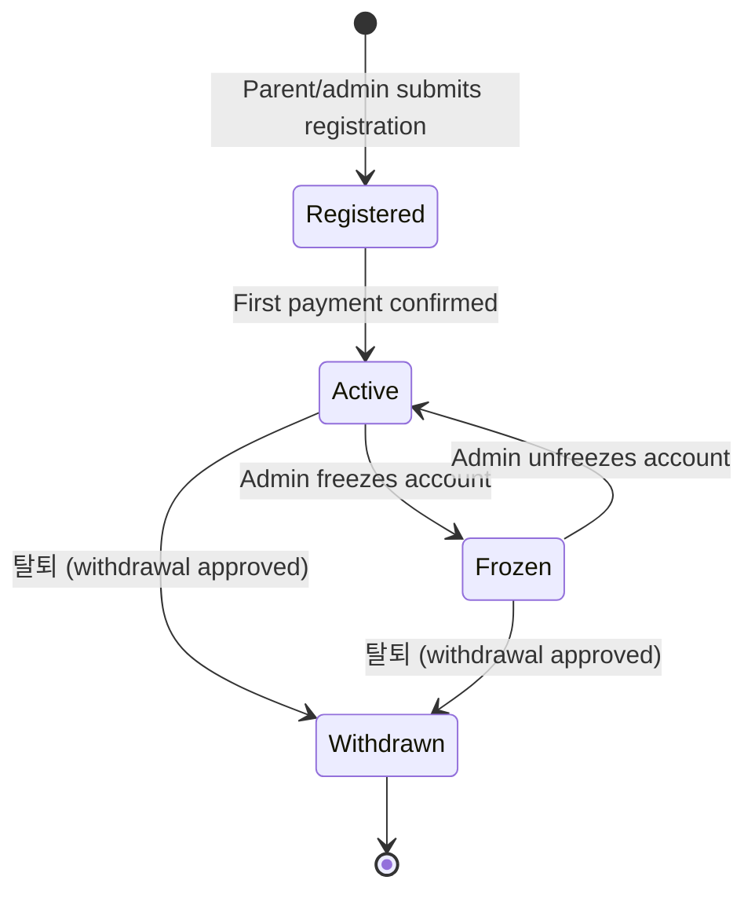
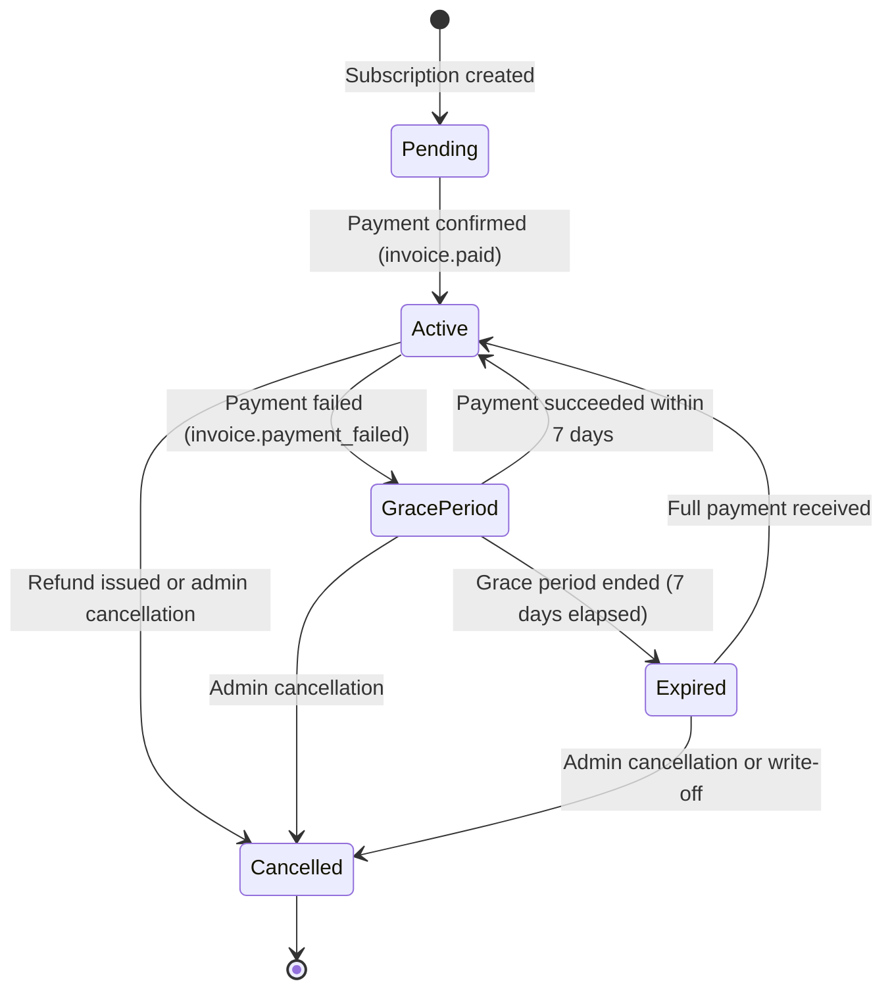
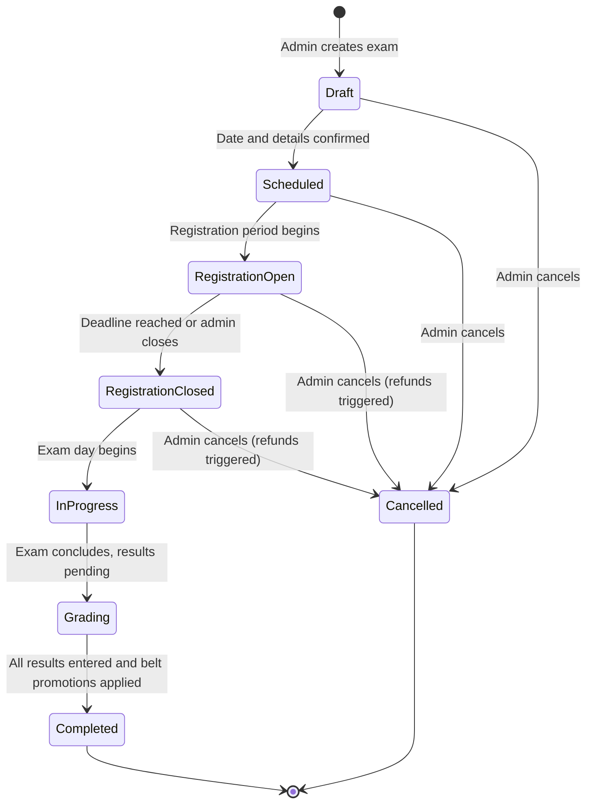
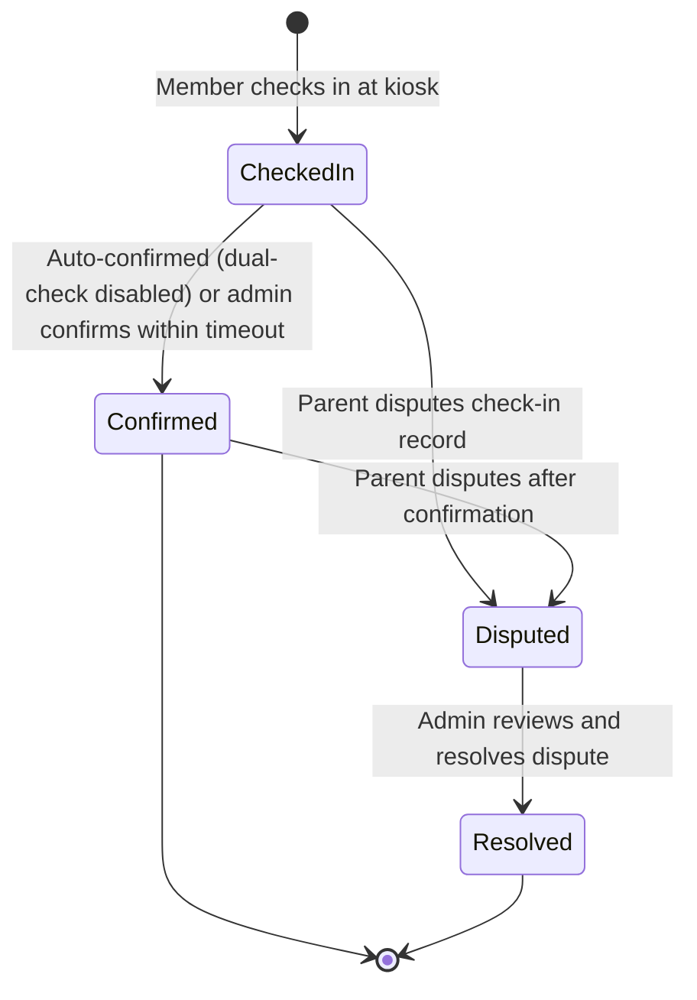

# 3. Data Model

**Related TRDs**: [01-system-architecture](./01-system-architecture.md), [02-multi-tenancy](./02-multi-tenancy.md), [04-auth](./04-auth.md)  
**Related ADRs**: [ADR-003](./adr/003-multi-tenant-architecture.md)  
**Phase**: MVP (Phase 1)

---

### Entity Relationship Diagram

```mermaid
erDiagram
    TENANT ||--o{ USER : has
    TENANT ||--o{ MEMBER : has
    TENANT ||--o{ CLASS : has
    TENANT ||--o{ STAFF : has
    TENANT ||--o{ BELT : has
    TENANT ||--o{ SIMSA : has
    TENANT ||--o{ MEMBERSHIP_PLAN : has
    TENANT ||--o{ PAYMENT : has
    TENANT ||--o{ NOTIFICATION_TEMPLATE : has
    TENANT ||--o{ SYSTEM_SETTING : has

    USER ||--o{ PARENT : is
    USER ||--o{ ADMIN : is
    USER ||--o{ MEMBER : is

    PARENT ||--o{ PARENT_CHILD : has
    MEMBER ||--o{ PARENT_CHILD : has

    MEMBER ||--o{ MEMBER_BELT : has
    BELT ||--o{ MEMBER_BELT : has

    MEMBER ||--o{ ATTENDANCE : has
    CLASS ||--o{ ATTENDANCE : has
    STAFF ||--o{ ATTENDANCE : validates

    MEMBER ||--o{ SIMSA_REGISTRATION : registers_for
    SIMSA ||--o{ SIMSA_REGISTRATION : has
    SIMSA_REGISTRATION ||--o{ SIMSA_RESULT : has

    MEMBER ||--o{ MEMBERSHIP : has
    MEMBERSHIP_PLAN ||--o{ MEMBERSHIP : subscribes_to

    MEMBER ||--o{ PAYMENT : makes
    PAYMENT ||--o{ INVOICE : generates

    MEMBER ||--o{ NOTIFICATION : receives
    NOTIFICATION_TEMPLATE ||--o{ NOTIFICATION : uses

    CLASS ||--o{ CLASS_SCHEDULE : has
    CLASS ||--o{ CLASS_ENROLLMENT : has
    MEMBER ||--o{ CLASS_ENROLLMENT : enrolls_in

    MEMBER ||--o{ ACTIVITY_FEED_POST : creates
    ACTIVITY_FEED_POST ||--o{ ACTIVITY_FEED_PHOTO : contains
    ACTIVITY_FEED_POST ||--o{ ACTIVITY_FEED_REACTION : receives

    MEMBER ||--o{ AUDIT_LOG : triggers
    USER ||--o{ AUDIT_LOG : performs

    MEMBER ||--o{ USER_SESSION : has
```

### Core Entities

#### Tenant
Represents a single Taekwondo gym (the customer).

**Key Fields**:
- `tenant_id` (UUID, PK)
- `name` (String) - Gym name
- `email` (String) - Primary contact email
- `phone` (String) - Primary contact phone
- `address` (String) - Physical address
- `timezone` (String) - Timezone for scheduling
- `status` (Enum: Active, Suspended, Deleted) - Gym account status
- `created_at` (Timestamp)
- `updated_at` (Timestamp)

#### User
Represents any user in the system (parent, admin, member, staff).

**Key Fields**:
- `user_id` (UUID, PK)
- `tenant_id` (UUID, FK) - Scopes user to a gym
- `email` (String, nullable) - Email address (required for admins, optional for parents)
- `phone` (String, nullable) - Phone number (required for parents, optional for admins)
- `password_hash` (String, nullable) - Hashed password (for admin/staff)
- `role` (Enum: Owner, Manager, Instructor, Parent, Member) - Primary role
- `language` (Enum: English, Korean, Spanish) - Preferred language
- `status` (Enum: Active, Inactive, Suspended) - Account status
- `created_at` (Timestamp)
- `updated_at` (Timestamp)

#### Member
Represents a student/trainee enrolled at the gym.

**Key Fields**:
- `member_id` (UUID, PK)
- `tenant_id` (UUID, FK)
- `user_id` (UUID, FK) - Links to User record (if member has own account)
- `first_name` (String)
- `last_name` (String)
- `date_of_birth` (Date)
- `gender` (Enum: Male, Female, Other)
- `phone` (String, nullable)
- `email` (String, nullable)
- `profile_photo_url` (String, nullable) - URL to profile photo in S3
- `health_info` (JSON) - { allergies: [], medical_conditions: [], emergency_contact: {} }
- `status` (Enum: Pending, Active, Inactive, Withdrawn) - Registration/membership status
- `current_belt_id` (UUID, FK) - Current belt level
- `age_group` (String) - Auto-assigned based on DOB (e.g., "Little Kids", "Teens")
- `class_group` (String) - Assigned class group (e.g., "Beginner", "Advanced")
- `join_date` (Date)
- `withdrawal_date` (Date, nullable)
- `withdrawal_reason` (String, nullable)
- `created_at` (Timestamp)
- `updated_at` (Timestamp)

#### Parent
Represents a parent/guardian account.

**Key Fields**:
- `parent_id` (UUID, PK)
- `user_id` (UUID, FK) - Links to User record
- `tenant_id` (UUID, FK)
- `first_name` (String)
- `last_name` (String)
- `phone` (String) - Primary contact phone
- `email` (String, nullable)
- `preferred_messenger` (Enum: SMS, Email, KakaoTalk, WhatsApp, etc.) - Preferred communication channel
- `notification_channels` (JSONB) - Channel preferences: `{"sms": true, "push": true, "email": true, "kakao": false}` — each key is a boolean toggle
- `created_at` (Timestamp)
- `updated_at` (Timestamp)

#### ParentChild
Junction table linking parents to their children.

**Key Fields**:
- `parent_child_id` (UUID, PK)
- `tenant_id` (UUID, FK)
- `parent_id` (UUID, FK)
- `member_id` (UUID, FK)
- `relationship` (Enum: Mother, Father, Guardian, Other)
- `created_at` (Timestamp)

#### Staff
Represents an instructor or staff member.

**Key Fields**:
- `staff_id` (UUID, PK)
- `user_id` (UUID, FK)
- `tenant_id` (UUID, FK)
- `first_name` (String)
- `last_name` (String)
- `role` (Enum: Owner, Manager, Instructor)
- `phone` (String)
- `email` (String)
- `bio` (String, nullable)
- `photo_url` (String, nullable)
- `created_at` (Timestamp)
- `updated_at` (Timestamp)

#### Class
Represents a class offering (e.g., "Monday Evening Beginner").

**Key Fields**:
- `class_id` (UUID, PK)
- `tenant_id` (UUID, FK)
- `name` (String) - Class name
- `description` (String, nullable)
- `instructor_id` (UUID, FK) - Primary instructor
- `capacity` (Integer) - Max students
- `status` (Enum: Active, Inactive, Archived)
- `created_at` (Timestamp)
- `updated_at` (Timestamp)

#### ClassSchedule
Represents recurring schedule for a class.

**Key Fields**:
- `schedule_id` (UUID, PK)
- `class_id` (UUID, FK)
- `tenant_id` (UUID, FK)
- `day_of_week` (Enum: Monday - Sunday)
- `start_time` (Time) - HH:MM format
- `end_time` (Time)
- `created_at` (Timestamp)
- `updated_at` (Timestamp)

#### ClassEnrollment
Represents a member's enrollment in a class.

**Key Fields**:
- `enrollment_id` (UUID, PK)
- `class_id` (UUID, FK)
- `member_id` (UUID, FK)
- `tenant_id` (UUID, FK)
- `status` (Enum: Active, Paused, Withdrawn)
- `enrolled_date` (Date)
- `created_at` (Timestamp)
- `updated_at` (Timestamp)

#### Attendance
Represents a single check-in event.

**Key Fields**:
- `attendance_id` (UUID, PK)
- `member_id` (UUID, FK)
- `tenant_id` (UUID, FK)
- `class_id` (UUID, FK, nullable) - Class attended (if known)
- `check_in_time` (Timestamp) - When the member checked in
- `check_out_time` (Timestamp, nullable) - When the member left
- `method` (Enum: FaceRecognition, QRCode, NFC, NameSearch, Manual) - How they checked in
- `kiosk_id` (String, nullable) - Which kiosk device recorded the check-in
- `staff_validator_id` (UUID, FK, nullable) - Staff member who validated (if dual-check enabled)
- `validation_status` (Enum: Confirmed, PendingValidation, Unconfirmed) - Dual-check status
- `validation_time` (Timestamp, nullable) - When staff validated
- `created_at` (Timestamp)
- `updated_at` (Timestamp)

#### AttendanceAudit
Immutable audit log for attendance events (append-only).

**Key Fields**:
- `audit_id` (UUID, PK)
- `attendance_id` (UUID, FK)
- `tenant_id` (UUID, FK)
- `member_id` (UUID, FK)
- `event_type` (Enum: CheckIn, Validation, Unconfirmed, Sync) - What happened
- `event_data` (JSON) - Full event details (method, kiosk, staff, etc.)
- `created_at` (Timestamp) - Immutable

#### Belt
Represents a belt level in the gym's progression system.

**Key Fields**:
- `belt_id` (UUID, PK)
- `tenant_id` (UUID, FK)
- `name` (String) - Belt name (e.g., "White", "Yellow", "Black")
- `order` (Integer) - Progression order (0 = lowest, N = highest)
- `color` (String, nullable) - Hex color code for UI display
- `created_at` (Timestamp)
- `updated_at` (Timestamp)

#### MemberBelt
Tracks belt history for a member (one record per belt level achieved).

**Key Fields**:
- `member_belt_id` (UUID, PK)
- `member_id` (UUID, FK)
- `belt_id` (UUID, FK)
- `tenant_id` (UUID, FK)
- `achieved_date` (Date) - When the member achieved this belt
- `simsa_result_id` (UUID, FK, nullable) - Links to the simsa result that promoted them
- `is_current` (Boolean) - True if this is the member's current belt
- `created_at` (Timestamp)

#### Simsa
Represents a belt promotion exam event.

**Key Fields**:
- `simsa_id` (UUID, PK)
- `tenant_id` (UUID, FK)
- `name` (String) - Exam name (e.g., "Spring 2026 Belt Test")
- `scheduled_date` (Date)
- `scheduled_time` (Time)
- `location` (String, nullable)
- `eligible_belt_ids` (UUID Array) - Which belt levels can test
- `status` (Enum: Scheduled, NotificationSent, FormCollecting, Registered, Testing, ResultsEntered, Completed)
- `created_at` (Timestamp)
- `updated_at` (Timestamp)

#### SimsaRegistration
Represents a member's registration for a specific simsa event.

**Key Fields**:
- `registration_id` (UUID, PK)
- `simsa_id` (UUID, FK)
- `member_id` (UUID, FK)
- `tenant_id` (UUID, FK)
- `status` (Enum: Eligible, NotifiedParent, FormSubmitted, FeePaid, Testing, Completed)
- `form_submission_date` (Date, nullable)
- `fee_amount` (Decimal) - USD amount charged
- `payment_id` (UUID, FK, nullable) - Links to Payment record
- `created_at` (Timestamp)
- `updated_at` (Timestamp)

#### SimsaResult
Represents the outcome of a simsa for a member.

**Key Fields**:
- `result_id` (UUID, PK)
- `registration_id` (UUID, FK)
- `tenant_id` (UUID, FK)
- `member_id` (UUID, FK)
- `passed` (Boolean) - True if member passed
- `score` (Integer, nullable) - Numeric score if applicable
- `notes` (String, nullable) - Admin notes
- `result_date` (Date)
- `new_belt_id` (UUID, FK, nullable) - Belt achieved if passed
- `certificate_url` (String, nullable) - URL to generated certificate PDF
- `created_at` (Timestamp)
- `updated_at` (Timestamp)

#### Membership
Represents a member's subscription to a membership plan.

**Key Fields**:
- `membership_id` (UUID, PK)
- `member_id` (UUID, FK)
- `tenant_id` (UUID, FK)
- `plan_id` (UUID, FK)
- `status` (Enum: Active, GracePeriod, Suspended, Cancelled)
- `start_date` (Date)
- `renewal_date` (Date) - Next billing date
- `end_date` (Date, nullable) - When membership ends
- `stripe_subscription_id` (String) - Stripe subscription ID
- `created_at` (Timestamp)
- `updated_at` (Timestamp)

#### MembershipPlan
Represents a membership tier offered by the gym.

**Key Fields**:
- `plan_id` (UUID, PK)
- `tenant_id` (UUID, FK)
- `name` (String) - Plan name (e.g., "Monthly Unlimited")
- `description` (String, nullable)
- `price` (Decimal) - USD per billing cycle
- `billing_cycle` (Enum: Monthly, Annual)
- `trial_days` (Integer) - Free trial period (0 = no trial)
- `status` (Enum: Active, Inactive)
- `created_at` (Timestamp)
- `updated_at` (Timestamp)

#### MembershipHold
Represents a temporary hold on a membership (e.g., vacation, illness).

**Key Fields**:
- `hold_id` (UUID, PK)
- `membership_id` (UUID, FK)
- `tenant_id` (UUID, FK)
- `reason` (String) - Why the hold was placed
- `start_date` (Date)
- `end_date` (Date)
- `created_at` (Timestamp)
- `updated_at` (Timestamp)

#### Payment
Represents a payment transaction.

**Key Fields**:
- `payment_id` (UUID, PK)
- `member_id` (UUID, FK)
- `tenant_id` (UUID, FK)
- `amount` (Decimal) - USD
- `currency` (String) - Always "USD"
- `type` (Enum: Membership, Simsa, Equipment, Event, Other)
- `status` (Enum: Pending, Completed, Failed, Refunded)
- `stripe_payment_intent_id` (String) - Stripe reference
- `payment_method` (Enum: CreditCard, ACH, ApplePay, GooglePay)
- `created_at` (Timestamp)
- `updated_at` (Timestamp)

#### Invoice
Represents a billing invoice (may contain multiple line items).

**Key Fields**:
- `invoice_id` (UUID, PK)
- `member_id` (UUID, FK)
- `tenant_id` (UUID, FK)
- `invoice_number` (String) - Human-readable invoice ID
- `status` (Enum: Draft, Sent, Paid, Overdue, Cancelled)
- `subtotal` (Decimal)
- `tax_amount` (Decimal)
- `discount_amount` (Decimal)
- `total_amount` (Decimal)
- `due_date` (Date)
- `paid_date` (Date, nullable)
- `created_at` (Timestamp)
- `updated_at` (Timestamp)

#### InvoiceLineItem
Represents a single line item on an invoice.

**Key Fields**:
- `line_item_id` (UUID, PK)
- `invoice_id` (UUID, FK)
- `tenant_id` (UUID, FK)
- `description` (String) - What was charged (e.g., "Monthly Membership", "Belt Test Fee")
- `quantity` (Integer)
- `unit_price` (Decimal)
- `total_price` (Decimal)
- `created_at` (Timestamp)

#### Refund
Represents a refund issued to a member.

**Key Fields**:
- `refund_id` (UUID, PK)
- `payment_id` (UUID, FK)
- `member_id` (UUID, FK)
- `tenant_id` (UUID, FK)
- `amount` (Decimal) - USD refunded
- `reason` (Enum: Withdrawal, Overpayment, Dispute, Other)
- `status` (Enum: Pending, Completed, Failed)
- `stripe_refund_id` (String)
- `created_at` (Timestamp)
- `updated_at` (Timestamp)

#### Discount
Represents a discount applied to an invoice.

**Key Fields**:
- `discount_id` (UUID, PK)
- `invoice_id` (UUID, FK)
- `tenant_id` (UUID, FK)
- `type` (Enum: Percentage, FixedAmount)
- `value` (Decimal) - Percentage (0-100) or fixed USD amount
- `reason` (String) - Why discount was applied (e.g., "Sibling Discount", "Promotional")
- `created_at` (Timestamp)

#### Notification
Represents a notification sent to a user.

**Key Fields**:
- `notification_id` (UUID, PK)
- `recipient_id` (UUID, FK) - User who received it
- `tenant_id` (UUID, FK)
- `type` (Enum: ArrivalConfirmation, ClassSummary, ActivityPhoto, BeltPromotion, UpcomingSimsa, AttendanceStreak, PaymentReceipt, PaymentDue, MembershipExpiry, ScheduleChange, GymAnnouncement, etc.)
- `title` (String)
- `body` (String)
- `language` (Enum: English, Korean, Spanish) - Language sent in
- `channels` (JSONB) - Channels sent on: `{"sms": true, "push": true, "email": false, "kakao": false}` — boolean per channel
- `status` (Enum: Pending, Sent, Delivered, Failed, Read)
- `created_at` (Timestamp)
- `updated_at` (Timestamp)

#### NotificationTemplate
Represents a template for notifications.

**Key Fields**:
- `template_id` (UUID, PK)
- `tenant_id` (UUID, FK)
- `type` (Enum) - Notification type
- `language` (Enum: English, Korean, Spanish)
- `subject` (String) - For email
- `body` (String) - Template with personalization tokens: {{member_name}}, {{days_absent}}, {{balance_due}}, {{belt_level}}, {{simsa_date}}, {{gym_name}}, etc.
- `channels` (JSONB) - Default channels for this type: `{"sms": true, "push": true, "email": true, "kakao": false}` — boolean per channel
- `created_at` (Timestamp)
- `updated_at` (Timestamp)

#### NotificationLog
Immutable log of notification delivery attempts.

**Key Fields**:
- `log_id` (UUID, PK)
- `notification_id` (UUID, FK)
- `tenant_id` (UUID, FK)
- `channel` (Enum: Push, SMS, Email, InApp, Messenger)
- `status` (Enum: Sent, Delivered, Failed)
- `error_message` (String, nullable)
- `external_id` (String, nullable) - Reference from external service (e.g., Twilio message ID)
- `created_at` (Timestamp)

#### AlertRule
Represents a configurable alert rule.

**Key Fields**:
- `rule_id` (UUID, PK)
- `tenant_id` (UUID, FK)
- `trigger_type` (Enum: Absence, LatePayment, MembershipExpiry, SimsaDeadline)
- `thresholds` (JSON Array) - Threshold values (e.g., [3, 7, 14] for days absent)
- `template_id` (UUID, FK) - Notification template to use
- `channels` (JSONB) - Channels to send on: `{"sms": true, "push": true, "email": true, "kakao": false}` — boolean per channel
- `escalation_config` (JSON) - { consecutive_ignores: 2, escalate_to_admin: true }
- `enabled` (Boolean)
- `created_at` (Timestamp)
- `updated_at` (Timestamp)

#### Newsletter
Represents a formal newsletter (가정통신문).

**Key Fields**:
- `newsletter_id` (UUID, PK)
- `tenant_id` (UUID, FK)
- `title` (String)
- `body` (String) - Rich HTML content
- `attachments` (JSON Array) - URLs to attached documents
- `audience_filter` (JSON) - Filter criteria: { classes: [], belt_levels: [], age_groups: [], membership_status: [] }
- `status` (Enum: Draft, Scheduled, Sent)
- `scheduled_at` (Timestamp, nullable)
- `sent_at` (Timestamp, nullable)
- `created_by` (UUID, FK) - Staff member who created it
- `created_at` (Timestamp)
- `updated_at` (Timestamp)

#### NewsletterRecipient
Tracks which parents received a newsletter.

**Key Fields**:
- `recipient_id` (UUID, PK)
- `newsletter_id` (UUID, FK)
- `parent_id` (UUID, FK)
- `tenant_id` (UUID, FK)
- `sent_at` (Timestamp)
- `read_at` (Timestamp, nullable)
- `created_at` (Timestamp)

#### ActivityFeedPost
Represents a post in the parent activity feed.

**Key Fields**:
- `post_id` (UUID, PK)
- `tenant_id` (UUID, FK)
- `class_id` (UUID, FK, nullable) - Class this post is about
- `posted_by` (UUID, FK) - Staff member who posted
- `type` (Enum: TrainingNotes, Photo, Observation, Milestone)
- `content` (String) - Text content
- `visibility` (Enum: Class, Individual) - Who can see it
- `visible_to_member_id` (UUID, FK, nullable) - If visibility=Individual, which member
- `created_at` (Timestamp)
- `updated_at` (Timestamp)

#### ActivityFeedPhoto
Represents a photo in an activity feed post.

**Key Fields**:
- `photo_id` (UUID, PK)
- `post_id` (UUID, FK)
- `tenant_id` (UUID, FK)
- `photo_url` (String) - S3 URL
- `thumbnail_url` (String) - S3 URL to thumbnail
- `created_at` (Timestamp)

#### ActivityFeedReaction
Represents a parent's reaction to a feed post.

**Key Fields**:
- `reaction_id` (UUID, PK)
- `post_id` (UUID, FK)
- `parent_id` (UUID, FK)
- `tenant_id` (UUID, FK)
- `type` (Enum: Like, Comment)
- `content` (String, nullable) - Comment text if type=Comment
- `created_at` (Timestamp)

#### AuditLog
Immutable log of all data mutations.

**Key Fields**:
- `log_id` (UUID, PK)
- `tenant_id` (UUID, FK)
- `actor_id` (UUID, FK) - User who made the change
- `actor_role` (Enum) - Role of the actor
- `action` (Enum: Create, Update, Delete)
- `entity_type` (String) - What was changed (e.g., "Member", "Payment")
- `entity_id` (UUID) - Which record was changed
- `old_value` (JSON, nullable) - Previous state
- `new_value` (JSON, nullable) - New state
- `ip_address` (String, nullable)
- `created_at` (Timestamp) - Immutable

#### UserSession
Represents an active user session.

**Key Fields**:
- `session_id` (UUID, PK)
- `user_id` (UUID, FK)
- `tenant_id` (UUID, FK)
- `jwt_token` (String) - The JWT token
- `ip_address` (String)
- `user_agent` (String)
- `expires_at` (Timestamp)
- `created_at` (Timestamp)

#### SystemSetting
Stores per-gym configuration (see section 2 for full list of settings).

**Key Fields**:
- `setting_id` (UUID, PK)
- `tenant_id` (UUID, FK)
- `key` (String) - Setting name
- `value` (JSON) - Setting value (type varies)
- `created_at` (Timestamp)
- `updated_at` (Timestamp)

### Field Validation Rules

All string lengths are in characters. All UUIDs are v4 format. All timestamps are `timestamptz` stored in UTC. All monetary values are `DECIMAL(10,2)` in USD.

#### Tenant & System

| Field | Type | Constraints | Nullable | Default |
|-------|------|-------------|----------|---------|
| `tenant.name` | String | Min 1, max 100 | N | — |
| `tenant.email` | String | Min 1, max 255, RFC 5322 email format | N | — |
| `tenant.phone` | String | 10–15 digits, regex `^\+?[1-9]\d{9,14}$` | N | — |
| `tenant.address` | String | Max 500 | N | — |
| `tenant.timezone` | String | IANA timezone identifier (e.g., `America/New_York`) | N | `America/New_York` |
| `tenant.status` | Enum | `Active`, `Suspended`, `Deleted` | N | `Active` |
| `system_setting.key` | String | Min 1, max 100, regex `^[a-z_]+$` | N | — |
| `system_setting.value` | JSONB | Valid JSON, schema depends on key | N | — |

#### Users & Authentication

| Field | Type | Constraints | Nullable | Default |
|-------|------|-------------|----------|---------|
| `user.email` | String | Max 255, RFC 5322 email format | Y | `null` |
| `user.phone` | String | 10–15 digits, regex `^\+?[1-9]\d{9,14}$` | Y | `null` |
| `user.password_hash` | String | Max 255, bcrypt format | Y | `null` |
| `user.role` | Enum | `Owner`, `Manager`, `Instructor`, `Parent`, `Member` | N | — |
| `user.language` | Enum | `English`, `Korean`, `Spanish` | N | `English` |
| `user.status` | Enum | `Active`, `Inactive`, `Suspended` | N | `Active` |
| `user_session.jwt_token` | String | Max 2048 | N | — |
| `user_session.ip_address` | String | Max 45 (IPv6) | N | — |
| `user_session.user_agent` | String | Max 500 | N | — |

#### Members & Parents

| Field | Type | Constraints | Nullable | Default |
|-------|------|-------------|----------|---------|
| `member.first_name` | String | Min 1, max 100 | N | — |
| `member.last_name` | String | Min 1, max 100 | N | — |
| `member.date_of_birth` | Date | Must be in the past, no earlier than 100 years ago | N | — |
| `member.gender` | Enum | `Male`, `Female`, `Other` | N | — |
| `member.phone` | String | 10–15 digits, regex `^\+?[1-9]\d{9,14}$` | Y | `null` |
| `member.email` | String | Max 255, RFC 5322 email format | Y | `null` |
| `member.profile_photo_url` | String | Max 500, valid URL | Y | `null` |
| `member.health_info` | JSONB | Schema: `{ allergies: string[], medical_conditions: string[], emergency_contact: { name: string, phone: string, relationship: string } }` | N | `{}` |
| `member.status` | Enum | `Pending`, `Active`, `Inactive`, `Withdrawn` | N | `Pending` |
| `member.age_group` | String | Max 50 | Y | `null` |
| `member.class_group` | String | Max 50 | Y | `null` |
| `member.withdrawal_reason` | String | Max 1000 | Y | `null` |
| `parent.first_name` | String | Min 1, max 100 | N | — |
| `parent.last_name` | String | Min 1, max 100 | N | — |
| `parent.phone` | String | 10–15 digits, regex `^\+?[1-9]\d{9,14}$` | N | — |
| `parent.email` | String | Max 255, RFC 5322 email format | Y | `null` |
| `parent.preferred_messenger` | Enum | `SMS`, `Email`, `KakaoTalk`, `WhatsApp` | N | `SMS` |
| `parent.notification_channels` | JSONB | Schema: `{"sms": boolean, "push": boolean, "email": boolean, "kakao": boolean}` — all keys required | N | `{"sms": true, "push": true, "email": true, "kakao": false}` |
| `parent_child.relationship` | Enum | `Mother`, `Father`, `Guardian`, `Other` | N | — |

#### Staff & Classes

| Field | Type | Constraints | Nullable | Default |
|-------|------|-------------|----------|---------|
| `staff.first_name` | String | Min 1, max 100 | N | — |
| `staff.last_name` | String | Min 1, max 100 | N | — |
| `staff.role` | Enum | `Owner`, `Manager`, `Instructor` | N | — |
| `staff.phone` | String | 10–15 digits, regex `^\+?[1-9]\d{9,14}$` | N | — |
| `staff.email` | String | Max 255, RFC 5322 email format | N | — |
| `staff.bio` | String | Max 1000 | Y | `null` |
| `staff.photo_url` | String | Max 500, valid URL | Y | `null` |
| `class.name` | String | Min 1, max 100 | N | — |
| `class.description` | String | Max 1000 | Y | `null` |
| `class.capacity` | Integer | Min 1, max 200 | N | — |
| `class.status` | Enum | `Active`, `Inactive`, `Archived` | N | `Active` |
| `class_schedule.day_of_week` | Enum | `Monday`, `Tuesday`, `Wednesday`, `Thursday`, `Friday`, `Saturday`, `Sunday` | N | — |
| `class_schedule.start_time` | Time | HH:MM format, must be before end_time | N | — |
| `class_schedule.end_time` | Time | HH:MM format, must be after start_time | N | — |
| `class_enrollment.status` | Enum | `Active`, `Paused`, `Withdrawn` | N | `Active` |

#### Attendance

| Field | Type | Constraints | Nullable | Default |
|-------|------|-------------|----------|---------|
| `attendance.check_in_time` | Timestamp | Must not be in the future (with 5-min tolerance) | N | — |
| `attendance.check_out_time` | Timestamp | Must be after check_in_time | Y | `null` |
| `attendance.method` | Enum | `FaceRecognition`, `QRCode`, `NFC`, `NameSearch`, `Manual` | N | — |
| `attendance.kiosk_id` | String | Max 100 | Y | `null` |
| `attendance.validation_status` | Enum | `Confirmed`, `PendingValidation`, `Unconfirmed` | N | `Confirmed` |
| `attendance_audit.event_type` | Enum | `CheckIn`, `Validation`, `Unconfirmed`, `Sync` | N | — |
| `attendance_audit.event_data` | JSONB | Schema varies by event_type; includes method, kiosk, staff, previous values | N | — |

#### Belts & Simsa

| Field | Type | Constraints | Nullable | Default |
|-------|------|-------------|----------|---------|
| `belt.name` | String | Min 1, max 50 | N | — |
| `belt.order` | Integer | Min 0; unique per tenant | N | — |
| `belt.color` | String | Max 7, hex format regex `^#[0-9A-Fa-f]{6}$` | Y | `null` |
| `member_belt.is_current` | Boolean | Only one `true` per member | N | `false` |
| `simsa.name` | String | Min 1, max 100 | N | — |
| `simsa.scheduled_date` | Date | Must be in the future at creation time | N | — |
| `simsa.scheduled_time` | Time | HH:MM format | N | — |
| `simsa.location` | String | Max 500 | Y | `null` |
| `simsa.eligible_belt_ids` | UUID[] | At least one belt required | N | — |
| `simsa.status` | Enum | `Draft`, `Scheduled`, `RegistrationOpen`, `RegistrationClosed`, `InProgress`, `Grading`, `Completed`, `Cancelled` | N | `Draft` |
| `simsa_registration.status` | Enum | `Eligible`, `NotifiedParent`, `FormSubmitted`, `FeePaid`, `Testing`, `Completed` | N | `Eligible` |
| `simsa_registration.fee_amount` | Decimal(10,2) | Min 0 | N | — |
| `simsa_result.passed` | Boolean | — | N | — |
| `simsa_result.score` | Integer | Min 0, max 100 | Y | `null` |
| `simsa_result.notes` | String | Max 1000 | Y | `null` |
| `simsa_result.certificate_url` | String | Max 500, valid URL | Y | `null` |

#### Memberships & Payments

| Field | Type | Constraints | Nullable | Default |
|-------|------|-------------|----------|---------|
| `membership.status` | Enum | `Active`, `GracePeriod`, `Suspended`, `Cancelled` | N | `Active` |
| `membership.stripe_subscription_id` | String | Max 255, Stripe format `sub_*` | N | — |
| `membership_plan.name` | String | Min 1, max 100 | N | — |
| `membership_plan.description` | String | Max 1000 | Y | `null` |
| `membership_plan.price` | Decimal(10,2) | Min 0.01 | N | — |
| `membership_plan.billing_cycle` | Enum | `Monthly`, `Annual` | N | — |
| `membership_plan.trial_days` | Integer | Min 0, max 365 | N | `0` |
| `membership_plan.status` | Enum | `Active`, `Inactive` | N | `Active` |
| `membership_hold.reason` | String | Min 1, max 1000 | N | — |
| `payment.amount` | Decimal(10,2) | Min 0.01 | N | — |
| `payment.currency` | String | Exactly 3 chars, always `USD` | N | `USD` |
| `payment.type` | Enum | `Membership`, `Simsa`, `Equipment`, `Event`, `Other` | N | — |
| `payment.status` | Enum | `Pending`, `Completed`, `Failed`, `Refunded` | N | `Pending` |
| `payment.stripe_payment_intent_id` | String | Max 255, Stripe format `pi_*` | N | — |
| `payment.payment_method` | Enum | `CreditCard`, `ACH`, `ApplePay`, `GooglePay` | N | — |
| `invoice.invoice_number` | String | Min 1, max 50, unique per tenant | N | — |
| `invoice.status` | Enum | `Draft`, `Sent`, `Paid`, `Overdue`, `Cancelled` | N | `Draft` |
| `invoice.subtotal` | Decimal(10,2) | Min 0 | N | — |
| `invoice.tax_amount` | Decimal(10,2) | Min 0 | N | `0.00` |
| `invoice.discount_amount` | Decimal(10,2) | Min 0 | N | `0.00` |
| `invoice.total_amount` | Decimal(10,2) | Min 0 | N | — |
| `invoice_line_item.description` | String | Min 1, max 500 | N | — |
| `invoice_line_item.quantity` | Integer | Min 1 | N | `1` |
| `invoice_line_item.unit_price` | Decimal(10,2) | Min 0 | N | — |
| `invoice_line_item.total_price` | Decimal(10,2) | Min 0 | N | — |
| `refund.amount` | Decimal(10,2) | Min 0.01, must not exceed original payment amount | N | — |
| `refund.reason` | Enum | `Withdrawal`, `Overpayment`, `Dispute`, `Other` | N | — |
| `refund.status` | Enum | `Pending`, `Completed`, `Failed` | N | `Pending` |
| `refund.stripe_refund_id` | String | Max 255, Stripe format `re_*` | N | — |
| `discount.type` | Enum | `Percentage`, `FixedAmount` | N | — |
| `discount.value` | Decimal(10,2) | If Percentage: 0.01–100.00; if FixedAmount: min 0.01 | N | — |
| `discount.reason` | String | Min 1, max 500 | N | — |

#### Notifications & Alerts

| Field | Type | Constraints | Nullable | Default |
|-------|------|-------------|----------|---------|
| `notification.type` | Enum | `ArrivalConfirmation`, `ClassSummary`, `ActivityPhoto`, `BeltPromotion`, `UpcomingSimsa`, `AttendanceStreak`, `PaymentReceipt`, `PaymentDue`, `MembershipExpiry`, `ScheduleChange`, `GymAnnouncement` | N | — |
| `notification.title` | String | Min 1, max 200 | N | — |
| `notification.body` | String | Min 1, max 2000 | N | — |
| `notification.language` | Enum | `English`, `Korean`, `Spanish` | N | — |
| `notification.channels` | JSONB | Schema: `{"sms": boolean, "push": boolean, "email": boolean, "kakao": boolean}` | N | — |
| `notification.status` | Enum | `Pending`, `Sent`, `Delivered`, `Failed`, `Read` | N | `Pending` |
| `notification_template.subject` | String | Max 200 | N | — |
| `notification_template.body` | String | Max 5000, supports tokens: `{{member_name}}`, `{{days_absent}}`, `{{balance_due}}`, `{{belt_level}}`, `{{simsa_date}}`, `{{gym_name}}` | N | — |
| `notification_template.channels` | JSONB | Schema: `{"sms": boolean, "push": boolean, "email": boolean, "kakao": boolean}` | N | — |
| `notification_log.channel` | Enum | `Push`, `SMS`, `Email`, `InApp`, `Messenger` | N | — |
| `notification_log.status` | Enum | `Sent`, `Delivered`, `Failed` | N | — |
| `notification_log.error_message` | String | Max 1000 | Y | `null` |
| `notification_log.external_id` | String | Max 255 | Y | `null` |
| `alert_rule.trigger_type` | Enum | `Absence`, `LatePayment`, `MembershipExpiry`, `SimsaDeadline` | N | — |
| `alert_rule.thresholds` | JSONB | Array of integers, e.g., `[3, 7, 14]` | N | — |
| `alert_rule.escalation_config` | JSONB | Schema: `{ consecutive_ignores: number, escalate_to_admin: boolean }` | N | `{"consecutive_ignores": 2, "escalate_to_admin": true}` |
| `alert_rule.channels` | JSONB | Schema: `{"sms": boolean, "push": boolean, "email": boolean, "kakao": boolean}` | N | — |
| `alert_rule.enabled` | Boolean | — | N | `true` |

#### Newsletter & Activity Feed

| Field | Type | Constraints | Nullable | Default |
|-------|------|-------------|----------|---------|
| `newsletter.title` | String | Min 1, max 200 | N | — |
| `newsletter.body` | String | Max 50000, rich HTML content | N | — |
| `newsletter.attachments` | JSONB | Array of URL strings, max 10 attachments | N | `[]` |
| `newsletter.audience_filter` | JSONB | Schema: `{ classes: UUID[], belt_levels: UUID[], age_groups: string[], membership_status: string[] }` | N | `{}` |
| `newsletter.status` | Enum | `Draft`, `Scheduled`, `Sent` | N | `Draft` |
| `activity_feed_post.type` | Enum | `TrainingNotes`, `Photo`, `Observation`, `Milestone` | N | — |
| `activity_feed_post.content` | String | Min 1, max 2000 | N | — |
| `activity_feed_post.visibility` | Enum | `Class`, `Individual` | N | `Class` |
| `activity_feed_photo.photo_url` | String | Max 500, valid S3 URL | N | — |
| `activity_feed_photo.thumbnail_url` | String | Max 500, valid S3 URL | N | — |
| `activity_feed_reaction.type` | Enum | `Like`, `Comment` | N | — |
| `activity_feed_reaction.content` | String | Max 1000 | Y | `null` |

#### Audit Log

| Field | Type | Constraints | Nullable | Default |
|-------|------|-------------|----------|---------|
| `audit_log.actor_role` | Enum | `Owner`, `Manager`, `Instructor`, `Parent`, `Member`, `System` | N | — |
| `audit_log.action` | Enum | `Create`, `Update`, `Delete` | N | — |
| `audit_log.entity_type` | String | Max 100 | N | — |
| `audit_log.old_value` | JSONB | Previous entity state | Y | `null` |
| `audit_log.new_value` | JSONB | New entity state | Y | `null` |
| `audit_log.ip_address` | String | Max 45 (IPv6) | Y | `null` |

---

### State Machine Diagrams

#### Member Lifecycle



**Transitions**:
- `Registered → Active`: Triggered when first membership payment is confirmed via Stripe `invoice.paid` webhook.
- `Active → Frozen`: Admin action via admin dashboard. Member cannot check in at kiosk. Membership billing paused.
- `Frozen → Active`: Admin action. Membership billing resumes from next cycle.
- `Active/Frozen → Withdrawn`: Withdrawal request approved by admin. Triggers prorated refund, data deletion workflow, and cancellation of all enrollments.

#### Membership Lifecycle



**Transitions**:
- `Pending → Active`: Stripe `invoice.paid` webhook received for the initial subscription payment.
- `Active → GracePeriod`: Stripe `invoice.payment_failed` webhook. Member retains access for 7 days. Escalating reminders sent at Day 1 (email), Day 3 (SMS), Day 7 (admin alert).
- `GracePeriod → Expired`: Daily cron job checks `grace_period_end_date < now()`. Kiosk check-in is blocked.
- `Expired → Active`: Parent makes full payment. Membership restored immediately.
- `→ Cancelled`: Admin cancellation, refund issuance, or write-off. Membership is terminated permanently.

#### Simsa (Belt Promotion Exam) Lifecycle



**Transitions**:
- `Draft → Scheduled`: Admin confirms exam date, belt eligibility, and fee structure.
- `Scheduled → RegistrationOpen`: System identifies eligible members and dispatches notifications. Parents can begin registering.
- `RegistrationOpen → RegistrationClosed`: Registration deadline reached (cron job) or admin manually closes registration.
- `RegistrationClosed → InProgress`: Exam date arrives. Automatic transition at scheduled start time.
- `InProgress → Grading`: Exam concludes. Admin begins entering pass/fail results.
- `Grading → Completed`: All results submitted. Belt promotions auto-applied, congratulations notifications sent, certificates generated.
- `Any pre-InProgress state → Cancelled`: Admin cancels. All paid registrations receive automatic refunds. Cancellation notifications sent to all notified/registered parents.

#### Attendance Validation Lifecycle



**Transitions**:
- `→ CheckedIn`: Member checks in via any method (face recognition, QR, name search, staff manual). `validation_status = PendingValidation` if dual-check is enabled.
- `CheckedIn → Confirmed`: If dual-check disabled: immediate auto-confirmation. If dual-check enabled: staff confirms within the configured timeout (default 5 min). Parent notification dispatched.
- `CheckedIn/Confirmed → Disputed`: Parent raises a dispute about the attendance record (incorrect time, wrong child, etc.) via the parent app.
- `Disputed → Resolved`: Admin reviews the dispute, checks the audit trail, and marks as resolved with a resolution note. `AttendanceAudit` record created with `event_type = Correction`.

---

### Additional Entity Definitions

#### ConsentRecord
Tracks COPPA and BIPA compliance consent from parents. Each consent action creates a new immutable record. Required before storing data for children under 13 and before face recognition enrollment.

**Key Fields**:
- `consent_id` (UUID, PK)
- `tenant_id` (UUID, FK → Tenant)
- `parent_id` (UUID, FK → Parent) - Parent who granted consent
- `child_id` (UUID, FK → Member, nullable) - Child the consent is for; null for adult self-consent
- `consent_type` (Enum: `coppa_data_collection`, `bipa_biometric`, `marketing_communications`, `photo_video_release`) - Type of consent granted
- `consent_version` (String) - Version identifier of the consent form shown (e.g., `v2.1`)
- `consent_text` (Text) - Full text of the consent form as displayed to the parent
- `signature_data` (Text, nullable) - Base64-encoded signature image captured from the parent's device
- `ip_address` (String) - IP address of the device used to grant consent
- `user_agent` (String) - Browser/app user agent string
- `granted_at` (Timestamp) - When consent was granted
- `revoked_at` (Timestamp, nullable) - When consent was revoked; null if still active
- `revoked_reason` (String, nullable) - Reason for revocation provided by parent or admin
- `created_at` (Timestamp)
- `updated_at` (Timestamp)

**Validation Rules**:

| Field | Type | Constraints | Nullable | Default |
|-------|------|-------------|----------|---------|
| `consent_type` | Enum | `coppa_data_collection`, `bipa_biometric`, `marketing_communications`, `photo_video_release` | N | — |
| `consent_version` | String | Min 1, max 20, regex `^v\d+\.\d+$` | N | — |
| `consent_text` | Text | Min 1, max 50000 | N | — |
| `signature_data` | Text | Max 500000 (base64 encoded image) | Y | `null` |
| `ip_address` | String | Max 45 (IPv6) | N | — |
| `user_agent` | String | Max 500 | N | — |
| `revoked_reason` | String | Max 1000 | Y | `null` |

#### MemberAbsenceAlert
Tracks consecutive absence alerts sent to parents. Created by the daily absence alert cron job when a member exceeds configured absence thresholds. Records are deleted when the member next checks in, allowing re-triggering on future absences.

**Key Fields**:
- `alert_id` (UUID, PK)
- `tenant_id` (UUID, FK → Tenant)
- `member_id` (UUID, FK → Member) - The absent member
- `alert_rule_id` (UUID, FK → AlertRule) - The rule that triggered this alert
- `consecutive_absences` (Integer) - Number of consecutive days absent at time of alert
- `last_attendance_date` (Date) - Date of the member's most recent check-in
- `alert_sent_at` (Timestamp) - When the alert notification was dispatched
- `acknowledged_at` (Timestamp, nullable) - When a staff member acknowledged the alert
- `acknowledged_by` (UUID, FK → User, nullable) - Staff member who acknowledged
- `notes` (Text, nullable) - Staff notes on follow-up actions taken
- `created_at` (Timestamp)

**Validation Rules**:

| Field | Type | Constraints | Nullable | Default |
|-------|------|-------------|----------|---------|
| `consecutive_absences` | Integer | Min 1 | N | — |
| `last_attendance_date` | Date | Must be in the past | N | — |
| `notes` | Text | Max 2000 | Y | `null` |

---

### Database Index Strategy

All queries in Ararat are tenant-scoped. Every table includes `tenant_id` as the leading column in composite indexes to ensure efficient multi-tenant query patterns with PostgreSQL.

#### Composite Indexes (tenant-scoped queries)

| Table | Index Columns | Type | Purpose |
|-------|--------------|------|---------|
| `parent` | `(tenant_id, email)` | UNIQUE | Parent lookup by email within a gym |
| `parent` | `(tenant_id, phone)` | UNIQUE | Parent lookup by phone within a gym |
| `member` | `(tenant_id, status)` | B-tree | Filter active/pending/withdrawn members per gym |
| `member` | `(tenant_id, current_belt_id)` | B-tree | Filter members by belt level |
| `member` | `(tenant_id, age_group)` | B-tree | Filter members by age group |
| `member` | `(tenant_id, class_group)` | B-tree | Filter members by class group |
| `user` | `(tenant_id, email)` | UNIQUE | User lookup by email within a gym |
| `user` | `(tenant_id, phone)` | UNIQUE | User lookup by phone within a gym |
| `user` | `(tenant_id, role)` | B-tree | Filter users by role (e.g., all instructors) |
| `attendance` | `(tenant_id, member_id, check_in_time)` | B-tree | Member attendance history queries |
| `attendance` | `(tenant_id, class_id, check_in_time)` | B-tree | Class attendance on a given date |
| `attendance` | `(tenant_id, check_in_time)` | B-tree | Today's attendance, date-range queries |
| `attendance_audit` | `(tenant_id, attendance_id, created_at)` | B-tree | Audit trail per attendance record |
| `membership` | `(tenant_id, status)` | B-tree | Filter memberships by status (active, grace period) |
| `membership` | `(tenant_id, member_id)` | B-tree | Member's membership history |
| `membership` | `(tenant_id, renewal_date)` | B-tree | Upcoming renewal date queries for billing cron |
| `membership_plan` | `(tenant_id, status)` | B-tree | Active plans for subscription selection |
| `payment` | `(tenant_id, member_id, created_at)` | B-tree | Member payment history |
| `payment` | `(tenant_id, status)` | B-tree | Pending/failed payment queries |
| `invoice` | `(tenant_id, status, due_date)` | B-tree | Overdue invoice queries for reminder cron |
| `invoice` | `(tenant_id, member_id)` | B-tree | Member invoice history |
| `simsa` | `(tenant_id, scheduled_date)` | B-tree | Upcoming exams query |
| `simsa` | `(tenant_id, status)` | B-tree | Filter exams by status |
| `simsa_registration` | `(tenant_id, simsa_id, member_id)` | UNIQUE | Prevent duplicate registrations |
| `simsa_result` | `(tenant_id, registration_id)` | B-tree | Results lookup per registration |
| `member_belt` | `(tenant_id, member_id, is_current)` | B-tree | Current belt lookup |
| `notification` | `(tenant_id, recipient_id, created_at)` | B-tree | User notification history |
| `notification` | `(tenant_id, status)` | B-tree | Pending notification queue processing |
| `alert_rule` | `(tenant_id, trigger_type, enabled)` | B-tree | Active rules by trigger type |
| `member_absence_alert` | `(tenant_id, member_id)` | B-tree | Absence alerts per member (for reset on check-in) |
| `consent_record` | `(tenant_id, parent_id, consent_type)` | B-tree | Active consents per parent |
| `consent_record` | `(tenant_id, child_id, consent_type)` | B-tree | Active consents per child |
| `class_enrollment` | `(tenant_id, class_id, status)` | B-tree | Active enrollments per class |
| `class_enrollment` | `(tenant_id, member_id)` | B-tree | Member's enrolled classes |
| `class_schedule` | `(tenant_id, class_id, day_of_week)` | B-tree | Schedule lookup for auto-matching |
| `parent_child` | `(tenant_id, parent_id)` | B-tree | Parent's children lookup |
| `parent_child` | `(tenant_id, member_id)` | B-tree | Child's parents lookup |
| `newsletter` | `(tenant_id, status, scheduled_at)` | B-tree | Scheduled newsletter dispatch |
| `newsletter_recipient` | `(tenant_id, newsletter_id, parent_id)` | UNIQUE | Prevent duplicate delivery |
| `activity_feed_post` | `(tenant_id, class_id, created_at)` | B-tree | Class feed posts |
| `audit_log` | `(tenant_id, entity_type, entity_id)` | B-tree | Audit trail per entity |
| `audit_log` | `(tenant_id, actor_id, created_at)` | B-tree | Audit trail per actor |
| `user_session` | `(tenant_id, user_id, expires_at)` | B-tree | Active session lookup |

#### Unique Constraints

| Table | Columns | Notes |
|-------|---------|-------|
| `parent` | `(tenant_id, email)` | One email per parent per gym (where email is not null) |
| `parent` | `(tenant_id, phone)` | One phone per parent per gym |
| `user` | `(tenant_id, email)` | One email per user per gym (where email is not null) |
| `user` | `(tenant_id, phone)` | One phone per user per gym (where phone is not null) |
| `invoice` | `(tenant_id, invoice_number)` | Invoice numbers unique within a gym |
| `simsa_registration` | `(tenant_id, simsa_id, member_id)` | One registration per member per exam |
| `newsletter_recipient` | `(tenant_id, newsletter_id, parent_id)` | One delivery per parent per newsletter |
| `belt` | `(tenant_id, order)` | Belt ordering unique within a gym |

#### Partial Indexes (soft-delete optimization)

Tables using soft-delete (`deleted_at` column) include partial indexes to exclude deleted records from normal queries:

```sql
-- Members: most queries only want non-deleted records
CREATE INDEX idx_member_tenant_status_active
  ON member (tenant_id, status)
  WHERE deleted_at IS NULL;

-- Parents: lookup by phone/email excludes deleted accounts
CREATE UNIQUE INDEX idx_parent_tenant_email_active
  ON parent (tenant_id, email)
  WHERE deleted_at IS NULL AND email IS NOT NULL;

CREATE UNIQUE INDEX idx_parent_tenant_phone_active
  ON parent (tenant_id, phone)
  WHERE deleted_at IS NULL;

-- Users: active session and login queries
CREATE UNIQUE INDEX idx_user_tenant_email_active
  ON "user" (tenant_id, email)
  WHERE deleted_at IS NULL AND email IS NOT NULL;

CREATE UNIQUE INDEX idx_user_tenant_phone_active
  ON "user" (tenant_id, phone)
  WHERE deleted_at IS NULL AND phone IS NOT NULL;

-- Memberships: active memberships only
CREATE INDEX idx_membership_tenant_active
  ON membership (tenant_id, member_id)
  WHERE deleted_at IS NULL AND status IN ('Active', 'GracePeriod');
```

#### GIN Indexes (JSONB fields)

JSONB fields use GIN indexes for efficient containment and key-existence queries:

```sql
-- Member health info: query allergies, medical conditions
CREATE INDEX idx_member_health_info ON member USING GIN (health_info);

-- Parent notification channels: filter by channel preferences
CREATE INDEX idx_parent_notification_channels ON parent USING GIN (notification_channels);

-- Alert rule thresholds: query by threshold values
CREATE INDEX idx_alert_rule_thresholds ON alert_rule USING GIN (thresholds);

-- Alert rule escalation config
CREATE INDEX idx_alert_rule_escalation ON alert_rule USING GIN (escalation_config);

-- Newsletter audience filter: complex audience targeting queries
CREATE INDEX idx_newsletter_audience ON newsletter USING GIN (audience_filter);

-- System settings: query setting values
CREATE INDEX idx_system_setting_value ON system_setting USING GIN (value);

-- Notification channels: filter by delivery channels
CREATE INDEX idx_notification_channels ON notification USING GIN (channels);

-- Notification template channels: filter by default channels
CREATE INDEX idx_notification_template_channels ON notification_template USING GIN (channels);
```

---

### Service Dependencies

#### Services This Feature Consumes
| Service | Repo | Endpoint | Method | Request Shape | Response Shape |
|---------|------|----------|--------|---------------|----------------|
| _None_ | | | | | |

#### Contracts This Feature Exposes
| Endpoint | Method | Consumer(s) | Request Shape | Response Shape |
|----------|--------|-------------|---------------|----------------|
| _None_ | | | | |

> The Data Model TRD is a schema definition document. It does not expose or consume service endpoints directly. All entities defined here are consumed by feature TRDs (09–18) through their respective service layers and TypeORM entity definitions.

### Implementation Notes

> _This section will be updated as the feature is implemented._

- **Module location**: _TBD_
- **Key files**: _TBD_
- **Actual endpoints**: _TBD_
- **Deviations from spec**: _None yet_
- **Edge cases discovered**: _None yet_
- **Configuration**: _TBD_
