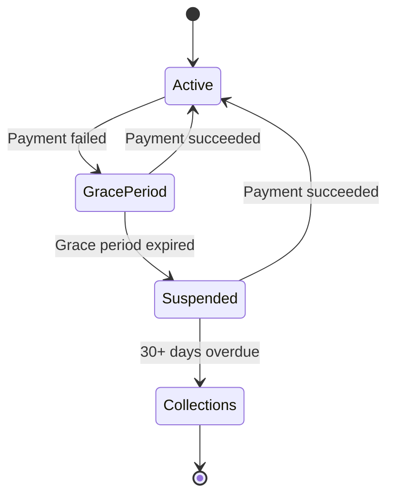

# 10. Feature: Payment & Billing

**Related TRDs**: [02-multi-tenancy](./02-multi-tenancy.md), [03-data-model](./03-data-model.md), [07-registration](./07-registration.md), [11-simsa](./11-simsa.md)  
**Related ADRs**: [ADR-001](./adr/001-us-market-only.md), [ADR-009](./adr/009-stripe-only-payments.md)  
**Phase**: MVP (Phase 1)

---

### Stripe Integration

Ararat uses Stripe for all payment processing:

**Decision**: Single Stripe account with metadata-based routing (vs. Stripe Connect with separate accounts per gym).

**Rationale**:
- Simpler implementation and reconciliation.
- Easier to manage payouts (single bank account).
- Gym-specific data stored in Stripe metadata: `{ tenant_id, gym_name }`.

**Stripe Objects**:
- `Customer` - Represents a member (one per member).
- `Subscription` - Recurring membership billing.
- `PaymentIntent` - One-time charges (simsa fees, equipment).
- `Invoice` - Billing invoice (generated by Stripe for subscriptions, or created manually for one-time charges).

### Recurring Billing Flow

1. Gym owner creates MembershipPlan: name, price, billing_cycle (monthly/annual), trial_days.
2. Member subscribes to plan via parent app.
3. System creates Stripe Customer for member (if not exists).
4. System creates Stripe Subscription with:
   - `customer_id` - Stripe customer ID
   - `price_data` - Amount, currency, billing interval
   - `trial_period_days` - Trial period (if applicable)
   - `metadata` - { tenant_id, member_id, plan_id }
5. Stripe charges on renewal date.
6. Stripe sends webhook `invoice.paid` to Ararat.
7. Ararat processes webhook:
   - Update Membership.status = Active.
   - Update Membership.renewal_date = next billing date.
   - Create Payment record with status=Completed.
   - Create Invoice record.
   - Send payment receipt notification to parent.

### Grace Period Logic

If payment fails:

1. Stripe sends webhook `invoice.payment_failed`.
2. Ararat processes webhook:
   - Update Membership.status = GracePeriod.
   - Calculate grace period end date: today + grace_period_days (configurable, default 10).
   - Create escalating reminders:
     - Day 1: Email reminder with payment link.
     - Day 5: SMS reminder.
     - Day 10: Admin alert + membership warning notification to parent.
3. If payment succeeds during grace period:
   - Update Membership.status = Active.
   - Send confirmation notification.
4. If grace period expires without payment:
   - Update Membership.status = Suspended.
   - Block member from checking in at kiosk.
   - Send suspension notification to parent.

### Family Billing

Parent account can link multiple children:

1. Parent adds child profiles during registration.
2. Each child has separate Membership record.
3. When billing: system aggregates all children's memberships into single Invoice.
4. Invoice has multiple LineItems (one per child).
5. Sibling discount auto-applied:
   - Gym configures discount in SystemSetting: `{ type: "percentage", value: 10 }` or `{ type: "fixed_amount", value: 15 }`.
   - System applies discount to 2nd+ child.
   - Example: 2 children at $100/month each = $200 - $10 (10% discount on 2nd) = $190.
6. Single Stripe Subscription created with aggregated amount.
7. Single payment charged to parent's card.

### Refund Calculation

On withdrawal:

```
refund = (remaining_days / total_days) * paid_amount - discount_clawback

remaining_days = days from withdrawal date to next renewal date
total_days = days from membership start to renewal date
paid_amount = amount paid for current cycle
discount_clawback = if discount was applied, percentage of discount to claw back (configurable per gym)
```

Example:
- Membership: $100/month, started Feb 1, renewal Mar 1 (28 days).
- Withdrawal: Feb 15 (13 days remaining).
- Refund: (13/28) * $100 = $46.43.
- If 10% sibling discount ($10) was applied: clawback 50% = $5.
- Final refund: $46.43 - $5 = $41.43.

### One-Time Charges

#### 심사 (Belt Test) Fees

1. Admin schedules 심사 event.
2. System identifies eligible members.
3. Parent receives notification with exam details and fee.
4. Parent submits consent form and payment.
5. System creates PaymentIntent for simsa fee.
6. Parent completes payment via Stripe.
7. Stripe sends webhook `charge.succeeded`.
8. Ararat processes webhook:
   - Update SimsaRegistration.status = FeePaid.
   - Create Payment record.
   - Send receipt notification.

#### Equipment/Retail Sales

1. Admin creates product in system (uniform, belt, sparring gear, etc.).
2. Parent purchases via app.
3. System creates PaymentIntent.
4. Parent completes payment.
5. System creates Payment and Invoice records.
6. Send receipt notification.

### Invoice Model

Invoice has multiple LineItems:

```
Invoice:
  - invoice_id
  - member_id
  - status (Draft, Sent, Paid, Overdue, Cancelled)
  - subtotal
  - tax_amount
  - discount_amount
  - total_amount
  - due_date
  - paid_date

LineItem:
  - description (e.g., "Monthly Membership", "Belt Test Fee", "Uniform")
  - quantity
  - unit_price
  - total_price
```

Tax is calculated per US state (configurable rate in SystemSetting).

### Late Payment State Machine




### Implementation Notes

> _This section will be updated as the feature is implemented._

- **Module location**: _TBD_
- **Key files**: _TBD_
- **Actual endpoints**: _TBD_
- **Deviations from spec**: _None yet_
- **Edge cases discovered**: _None yet_
- **Configuration**: _TBD_
