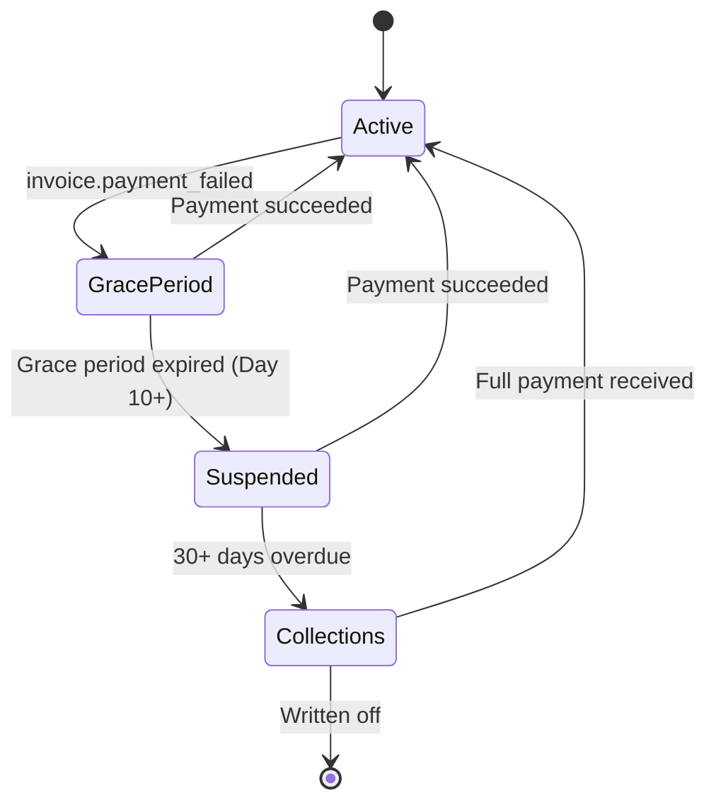

# 11. Feature: Payment & Billing

**Related TRDs**: [02-multi-tenancy](./02-multi-tenancy.md), [03-data-model](./03-data-model.md), [09-registration](./09-registration.md), [12-simsa](./12-simsa.md)  
**Related ADRs**: [ADR-001](./adr/001-us-market-only.md), [ADR-009](./adr/009-stripe-only-payments.md)  
**Phase**: MVP (Phase 1)

---

## Overview

Stripe-based payment processing for recurring memberships, one-time 심사 (belt test) fees, and equipment/retail purchases. Supports family billing with configurable sibling discounts, aggregated invoicing per parent account, and a full late-payment lifecycle with escalating reminders. All monetary values are in USD (per ADR-001). This TRD covers the backend service layer, Stripe webhook handling, and the complete frontend UX for both the Parent/Member App and the Admin App.

---

## Business Rules

### Stripe Integration

Ararat uses a **single Stripe account** with metadata-based routing (vs. Stripe Connect with separate accounts per gym).

**Rationale**:
- Simpler implementation and reconciliation.
- Easier to manage payouts (single bank account).
- Gym-specific data stored in Stripe metadata: `{ tenant_id, gym_name }`.

**Stripe Objects**:

| Stripe Object | Ararat Usage |
|---------------|-------------|
| `Customer` | One per parent account. Holds payment methods and billing info. |
| `Subscription` | Recurring membership billing. One per family (aggregated children). |
| `PaymentIntent` | One-time charges (심사 fees, equipment, manual invoices). |
| `Invoice` | Billing invoice — auto-generated for subscriptions, manually created for one-time charges. |

### Recurring Billing Flow

1. **Plan Creation**: Gym owner creates a `MembershipPlan` with name, price, billing cycle (monthly/quarterly/annual), and optional trial days.
2. **Subscription**: Parent subscribes child(ren) to a plan via the Parent App.
3. **Customer Creation**: System creates a Stripe `Customer` for the parent (if not already existing). The Stripe Customer ID is stored on the parent's User record.
4. **Stripe Subscription**: System creates a Stripe `Subscription` with:
   - `customer_id` — Stripe customer ID
   - `price_data` — amount, currency (USD), billing interval
   - `trial_period_days` — if applicable
   - `metadata` — `{ tenant_id, member_id, plan_id, family_id }`
5. **Auto-Charge**: Stripe charges the parent's default payment method on each renewal date.
6. **Success Webhook**: Stripe sends `invoice.paid` webhook to Ararat.
7. **Webhook Processing**: Ararat processes the webhook:
   - Update `Membership.status` → `Active`
   - Update `Membership.renewal_date` → next billing date
   - Create `Payment` record with `status = Completed`
   - Create `Invoice` record with line items
   - Send payment receipt notification to parent (via [13-notifications](./13-notifications.md))

### Grace Period Logic

When a recurring payment fails, the system enters an escalating reminder flow:

1. Stripe sends `invoice.payment_failed` webhook.
2. Ararat processes webhook:
   - Update `Membership.status` → `GracePeriod`
   - Calculate grace period end: `today + grace_period_days` (configurable per gym in `SystemSetting`, default: 10 days)
   - Schedule escalating reminders:
     - **Day 1**: Email reminder with direct payment link
     - **Day 5**: SMS reminder with payment link
     - **Day 10**: Admin alert + membership warning notification to parent
3. **If payment succeeds** during grace period:
   - Update `Membership.status` → `Active`
   - Cancel remaining scheduled reminders
   - Send confirmation notification to parent
4. **If grace period expires** without payment:
   - Update `Membership.status` → `Suspended`
   - Block member from kiosk check-in
   - Send suspension notification to parent
   - Create admin task for follow-up

### Late Payment State Machine



**State Transitions**:
- `Active → GracePeriod`: Triggered by Stripe `invoice.payment_failed` webhook. Membership remains functional during grace period.
- `GracePeriod → Suspended`: Cron job runs daily, checks `grace_period_end_date < now()`. Kiosk check-in is blocked.
- `Suspended → Collections`: Cron job flags accounts 30+ days overdue. Admin receives alert for manual follow-up.
- Any state → `Active`: Successful payment at any point restores active membership immediately.

### Family Billing

Parent accounts can link multiple children, and billing is aggregated per family:

1. Parent adds child profiles during registration (see [09-registration](./09-registration.md)).
2. Each child has a separate `Membership` record linked to a `MembershipPlan`.
3. At billing time, the system aggregates all children's memberships into a **single Invoice**.
4. Invoice contains multiple `LineItem` records (one per child).
5. **Sibling discount** is auto-applied:
   - Gym configures discount in `SystemSetting`: `{ type: "percentage", value: 10 }` or `{ type: "fixed_amount", value: 15 }`.
   - Discount applies to the 2nd child onward (cheapest-first ordering — discount applied to lower-priced memberships first).
   - Example: 2 children at $100/month each → $200 − $10 (10% discount on 2nd child) = **$190/month**.
   - Example: 3 children at $100/month → $100 + $90 + $90 = **$280/month**.
6. A single Stripe `Subscription` is created with the aggregated amount.
7. One payment charged to the parent's default payment method.

### Refund Calculation

On membership withdrawal or cancellation, refunds are prorated:

```
refund = (remaining_days / total_days) × paid_amount − discount_clawback

remaining_days  = days from withdrawal date to next renewal date
total_days      = total days in the current billing cycle
paid_amount     = amount paid for the current cycle
discount_clawback = if sibling discount was applied, configurable percentage to claw back (per gym SystemSetting)
```

**Example**:
- Membership: $100/month, cycle Feb 1 → Mar 1 (28 days)
- Withdrawal date: Feb 15 (13 days remaining)
- Base refund: (13 / 28) × $100 = **$46.43**
- Sibling discount of $10 was applied; clawback rate = 50%
- Discount clawback: $10 × 50% = $5.00
- **Final refund: $46.43 − $5.00 = $41.43**

Refunds are issued via Stripe Refund API and recorded as a `Payment` with `type = Refund`.

### One-Time Charges

#### 심사 (Belt Test) Fees

1. Admin schedules a 심사 event (see [12-simsa](./12-simsa.md) for scheduling details).
2. Parent receives notification with exam details and fee amount.
3. Parent submits consent form and payment via the Parent App.
4. System creates a Stripe `PaymentIntent` for the 심사 fee.
5. Parent completes payment (Stripe Checkout or embedded form).
6. Stripe sends `charge.succeeded` webhook.
7. Ararat processes webhook:
   - Update `SimsaRegistration.payment_status` → `Paid`
   - Create `Payment` record
   - Create `Invoice` with line item for 심사 fee
   - Send receipt notification

#### Equipment / Retail Sales

1. Admin creates a product in the system (uniform, belt, sparring gear, etc.).
2. Parent purchases via the Parent App or admin creates a manual invoice.
3. System creates a Stripe `PaymentIntent`.
4. Parent completes payment.
5. System creates `Payment` and `Invoice` records.
6. Send receipt notification.

### Invoice Model

Each invoice contains one or more line items:

```
Invoice:
  - invoice_id (UUID, PK)
  - tenant_id (UUID, FK)
  - parent_id (UUID, FK)        — the billing party
  - stripe_invoice_id (String)  — Stripe reference
  - status (Enum: Draft, Sent, Paid, Overdue, Refunded, Cancelled)
  - subtotal (Decimal)
  - tax_amount (Decimal)
  - discount_amount (Decimal)
  - total_amount (Decimal)
  - due_date (Date)
  - paid_date (Date, nullable)
  - created_at (Timestamp)

LineItem:
  - line_item_id (UUID, PK)
  - invoice_id (UUID, FK)
  - member_id (UUID, FK, nullable) — which child this line is for
  - description (String)            — e.g., "Monthly Membership — John", "Belt Test Fee"
  - quantity (Integer)
  - unit_price (Decimal)
  - discount_amount (Decimal)
  - total_price (Decimal)
  - type (Enum: Membership, SimsaFee, Equipment, Other)
```

**Tax Calculation**: Tax rate is configured per gym in `SystemSetting` (US state tax rate). Tax is calculated on the subtotal after discounts: `tax_amount = (subtotal - discount_amount) × tax_rate`.

---

## Backend

### API Endpoints

#### Payment & Invoice Endpoints

| Method | Path | Description | Auth |
|--------|------|-------------|------|
| `GET` | `/api/v1/tenants/{tenantId}/payments` | List payments (filterable by member, date range, status) | Parent (own), Admin |
| `GET` | `/api/v1/tenants/{tenantId}/invoices` | List invoices (filterable by status, date range, member) | Parent (own), Admin |
| `POST` | `/api/v1/tenants/{tenantId}/invoices` | Create manual invoice | Admin (Manager+) |
| `GET` | `/api/v1/tenants/{tenantId}/invoices/{id}` | Get invoice detail with line items | Parent (own), Admin |
| `POST` | `/api/v1/tenants/{tenantId}/invoices/{id}/refund` | Issue refund (full or partial) | Admin (Manager+) |

#### Subscription Endpoints

| Method | Path | Description | Auth |
|--------|------|-------------|------|
| `POST` | `/api/v1/tenants/{tenantId}/members/{id}/subscribe` | Subscribe member to a plan | Parent (own child), Admin |
| `DELETE` | `/api/v1/tenants/{tenantId}/members/{id}/subscription` | Cancel subscription (triggers prorated refund) | Parent (own child), Admin |

#### Membership Plan Endpoints

| Method | Path | Description | Auth |
|--------|------|-------------|------|
| `GET` | `/api/v1/tenants/{tenantId}/membership-plans` | List all plans (active + archived for admin) | Parent, Admin |
| `POST` | `/api/v1/tenants/{tenantId}/membership-plans` | Create new plan | Admin (Owner) |
| `PATCH` | `/api/v1/tenants/{tenantId}/membership-plans/{id}` | Update plan details | Admin (Owner) |

#### Dashboard Endpoints

| Method | Path | Description | Auth |
|--------|------|-------------|------|
| `GET` | `/api/v1/tenants/{tenantId}/payments/summary` | Payment summary stats (revenue, outstanding, overdue count, auto-pay rate) | Admin (Manager+) |

#### Stripe Webhook Endpoint

| Method | Path | Description |
|--------|------|-------------|
| `POST` | `/api/v1/webhooks/stripe` | Stripe webhook receiver (signature-verified) |

**Handled Webhook Events**:
- `invoice.paid` — Mark subscription invoice as paid, update membership status
- `invoice.payment_failed` — Trigger grace period flow
- `charge.succeeded` — Record one-time payment (심사, equipment)
- `charge.refunded` — Record refund, update invoice status
- `customer.subscription.deleted` — Handle external subscription cancellation
- `customer.subscription.updated` — Sync plan changes made directly in Stripe

### Service Logic

#### PaymentService

- **createStripeCustomer(parentId)**: Creates Stripe Customer, stores `stripe_customer_id` on User record. Idempotent — returns existing customer if already created.
- **subscribeToplan(memberId, planId)**: Validates plan exists and is active. Creates or updates Stripe Subscription. Handles family aggregation if parent has multiple children.
- **cancelSubscription(memberId)**: Cancels Stripe Subscription at period end. Calculates prorated refund. Updates membership status.
- **processInvoicePaid(stripeEvent)**: Webhook handler. Creates Payment + Invoice records. Updates Membership. Sends notification.
- **processPaymentFailed(stripeEvent)**: Webhook handler. Sets grace period. Schedules escalating reminders via notification service.
- **calculateRefund(memberId)**: Applies prorated refund formula. Accounts for sibling discount clawback. Returns refund breakdown for confirmation UI.
- **issueRefund(invoiceId, amount?)**: Issues full or partial refund via Stripe Refund API. Creates refund Payment record. Updates Invoice status.

#### FamilyBillingService

- **aggregateFamilyInvoice(parentId)**: Collects all active memberships for parent's children. Applies sibling discount rules. Generates single aggregated Invoice with per-child LineItems.
- **recalculateOnMembershipChange(parentId)**: Re-aggregates when a child is added/removed from a plan. Prorates mid-cycle changes.

#### GracePeriodCronJob

- Runs daily at 2:00 AM (gym timezone).
- Queries memberships where `status = GracePeriod` and `grace_period_end_date < now()`.
- Transitions expired memberships to `Suspended`.
- Sends suspension notifications.
- Creates admin tasks for follow-up.

#### CollectionsCronJob

- Runs daily at 3:00 AM (gym timezone).
- Queries memberships where `status = Suspended` and `suspended_date + 30 days < now()`.
- Transitions to `Collections` status.
- Sends admin alert for manual intervention.

---

## Parent/Member App

### Screen: Payments (`/payments`)

**Purpose**: Central billing hub for the parent — view all invoices across all children, manage payment methods, and make payments.

**Layout**: Single-column mobile-responsive layout with sticky month group headers.

**Sections**:
- **Payment Method Summary**: Card on file (last 4 digits, expiry), auto-pay status toggle. "Manage Payment Methods" link opens Stripe Customer Portal.
- **Invoice List**: All invoices grouped by month (most recent first). Each invoice card shows:
  - Amount (formatted as USD)
  - Status badge: `Paid` (green), `Pending` (yellow), `Overdue` (red), `Refunded` (gray)
  - Due date
  - Child name (or "Family" for aggregated invoices)
  - Brief description (e.g., "Monthly Membership", "Belt Test Fee")

**Key Components**:
- Month group headers (`<h3>` with month/year)
- Invoice `Card` with status `Badge`
- "Pay Now" `Button` on pending/overdue invoices (primary action)
- Auto-pay toggle (`Switch` component)
- Payment method summary `Card`
- Empty state: "No payment history yet."

**Data Sources**:
- `usePayments()` — paginated, sorted by date descending
- `usePaymentMethods()` — current payment methods from Stripe

**User Actions**:
| Action | Behavior |
|--------|----------|
| Tap "Pay Now" | Opens Stripe Checkout session or embedded payment form. On success, optimistic update to `Paid` status. |
| Toggle auto-pay | Calls API to enable/disable Stripe auto-charge. Shows confirmation toast. |
| Tap "Manage Payment Methods" | Opens Stripe Customer Portal in new tab/modal for card add/remove/update. |
| Tap invoice card | Navigates to invoice detail view showing full line items, tax breakdown, and receipt download. |
| View receipt | Download PDF receipt for paid invoices. |

### Screen: Child Detail — Payments Tab (`/children/:id` → Payments tab)

**Purpose**: View payment history and invoice status scoped to a single child's membership.

**Layout**: Tab within the Child Detail screen (alongside Profile, Attendance, Belt tabs).

**Content**:
- **Current Plan**: Plan name, price, billing cycle, next renewal date, status badge.
- **Invoice List**: Filtered to invoices containing line items for this child only. Same card format as the main Payments screen but without the child name column.
- **Payment History**: Chronological list of payments made for this child (completed, refunded).

**Data Sources**:
- `useMemberPayments(childId)` — invoices and payments filtered by member

**User Actions**:
- Tap an invoice to view details or make payment (same behavior as main Payments screen)
- View current plan details

---

## Admin App

### Screen: Payments Overview (`/payments`)

**Purpose**: Billing dashboard for gym administrators — financial summary, invoice management, and payment tracking.

**Layout**: Desktop-optimized with summary cards at top, tabbed content area below.

**Sections**:

#### Summary Cards (Top Row)
Four stat cards displayed in a horizontal row:

| Card | Value | Trend |
|------|-------|-------|
| Total Revenue (This Month) | `$XX,XXX` | vs. last month % change |
| Outstanding Balances | `$X,XXX` | count of unpaid invoices |
| Overdue Count | `N` | members with overdue payments |
| Auto-Pay Enrollment | `XX%` | percentage of active members |

#### Invoice Table
Full-featured data table powered by TanStack Table:

| Column | Type | Sortable | Filterable |
|--------|------|----------|------------|
| Invoice # | String | Yes | Search |
| Member Name | String (link) | Yes | Search |
| Amount | Currency | Yes | Range |
| Status | Badge | Yes | Multi-select (Paid, Pending, Overdue, Refunded, Cancelled) |
| Due Date | Date | Yes | Date range |
| Paid Date | Date | Yes | Date range |
| Type | Badge | Yes | Multi-select (Membership, SimsaFee, Equipment, Other) |

- Clicking a member name navigates to Member Detail page.
- Row actions: View detail, Send reminder, Issue refund.

#### Recent Transactions
Live feed of payments received (auto-refreshes every 60 seconds):
- Member name, amount, payment method (card type + last 4), timestamp
- Maximum 10 recent transactions shown, "View All" link for full history

**Key Components**:
- Summary stat `Card` widgets with trend indicators
- TanStack Table with column sorting, filtering, pagination
- Transaction feed list
- Action buttons: "Create Invoice", "Bulk Send Reminders", "Export"

**Data Sources**:
- `usePaymentSummary()` — aggregated stats
- `useInvoices(filters)` — paginated invoice list with server-side filtering
- `useRecentTransactions()` — latest payments (refetchInterval: 60s)

**User Actions**:
| Action | Behavior |
|--------|----------|
| Create Manual Invoice | Opens dialog: select member, add line items (description, qty, price), set due date. Saves as Draft or sends immediately. |
| Bulk Send Reminders | Select overdue invoices → confirm → sends payment reminder notification to all selected parents. |
| Issue Refund | Select invoice → opens confirmation dialog showing refund calculation (prorated amount, discount clawback). Requires reason input. |
| Export | Export filtered invoice list to Excel (.xlsx) or PDF. |
| Filter invoices | Server-side filtering by status, date range, member name, invoice type. |
| Click member name | Navigate to `/members/:id` (Payments tab). |

### Screen: Membership Plans (`/payments/plans`)

**Purpose**: CRUD interface for managing membership plans offered by the gym.

**Layout**: Table view with create/edit dialog.

**Plans Table** (TanStack Table):

| Column | Type | Sortable |
|--------|------|----------|
| Plan Name | String | Yes |
| Price | Currency | Yes |
| Billing Cycle | Badge (Monthly/Quarterly/Annual) | Yes |
| Active Members | Number (count) | Yes |
| Status | Badge (Active/Archived) | Yes |

**Create/Edit Dialog** (opens as Sheet or Dialog):

| Field | Type | Validation |
|-------|------|-----------|
| Plan Name | Text input | Required, max 100 chars |
| Price | Currency input | Required, > 0 |
| Billing Cycle | Select (Monthly, Quarterly, Annual) | Required |
| Description | Textarea | Optional, max 500 chars |
| Trial Days | Number input | Optional, 0–90 |
| Family Discount Type | Select (None, Percentage, Fixed Amount) | Required |
| Family Discount Value | Number input | Required if type ≠ None |

**Key Components**:
- TanStack Table with sorting and status filter
- `Dialog` or `Sheet` for create/edit form
- Archive confirmation `AlertDialog`
- Empty state: "No membership plans yet. Create your first plan."

**Data Sources**:
- `useMembershipPlans()` — all plans (active + archived for admins)

**User Actions**:
| Action | Behavior |
|--------|----------|
| Create Plan | Opens form dialog. On submit, creates plan via API. Plan is immediately available for member subscriptions. |
| Edit Plan | Opens pre-filled form dialog. Price changes apply to new billing cycles only (existing subscriptions keep current price until renewal). |
| Archive Plan | Confirmation dialog: "This plan has N active members. Archiving will prevent new subscriptions but existing members will continue on this plan." Cannot archive if no replacement plan exists. |
| View Members | Click active members count → navigates to member list filtered by this plan. |

### Screen: Member Detail — Payments Tab (`/members/:id` → Payments tab)

**Purpose**: Complete payment profile for an individual member, accessible from the Admin member detail screen.

**Layout**: Tab within the Member Detail screen (alongside Profile, Attendance, Belt & 심사, Activity Feed, Audit Log tabs).

**Content**:

#### Current Plan Section
- Plan name, price, billing cycle
- Subscription status badge (Active, GracePeriod, Suspended, Cancelled)
- Next renewal date
- Auto-pay status (enabled/disabled)
- "Change Plan" button (opens plan selection dialog)

#### Invoice History
Table of all invoices for this member:
- Invoice #, amount, status badge, due date, paid date
- Row click → invoice detail view

#### Payment History
Chronological list of all payments:
- Date, amount, type (Subscription, OneTime, Refund), payment method, status

**Key Components**:
- Plan info `Card` with status `Badge`
- Invoice `Table` (compact)
- Payment history list
- Action buttons: "Create Invoice", "Issue Refund", "Change Plan"

**Data Sources**:
- `useMemberPayments(memberId)` — invoices and payments for this member
- `useMember(memberId)` — membership and plan info

**User Actions**:
| Action | Behavior |
|--------|----------|
| Create Invoice | Opens manual invoice dialog pre-filled with member info. |
| Issue Refund | Opens refund dialog for selected invoice. Shows prorated calculation. Requires reason. |
| Change Plan | Opens plan selection dialog. Shows price difference and proration preview. |
| View Invoice Detail | Opens invoice detail with line items, tax breakdown, Stripe reference link. |

---

### Service Dependencies

#### Services This Feature Consumes
| Service | Repo | Endpoint | Method | Request Shape | Response Shape |
|---------|------|----------|--------|---------------|----------------|
| Stripe API | External | `POST /v1/customers`, `POST /v1/subscriptions`, `POST /v1/refunds` | POST | Stripe API objects | Stripe response objects |
| Stripe Webhooks | External | Receives `invoice.paid`, `invoice.payment_failed`, `charge.refunded`, `customer.subscription.deleted` | POST (inbound) | Stripe event JSON | `200 OK` |
| Notification Service | Internal (TRD 13) | Payment confirmations, failure alerts, receipt delivery | Internal call | `{ recipientId, templateId, data }` | `{ notificationId }` |

#### Contracts This Feature Exposes
| Endpoint | Method | Consumer(s) | Request Shape | Response Shape |
|----------|--------|-------------|---------------|----------------|
| `/api/v1/tenants/{tenantId}/membership-plans` | GET/POST/PATCH | Admin App | Plan config JSON | Plan list or detail |
| `/api/v1/tenants/{tenantId}/memberships` | GET/POST/PATCH | Admin App, Parent App | Membership data JSON | Membership list or detail |
| `/api/v1/tenants/{tenantId}/invoices` | GET | Admin App, Parent App | `?status=&memberId=` | Invoice list |
| `/api/v1/tenants/{tenantId}/payments` | GET/POST | Admin App, Parent App | Payment data JSON | Payment list or detail |
| `/api/v1/tenants/{tenantId}/refunds` | POST | Admin App | `{ paymentId, amount, reason }` | Refund confirmation |
| `/api/v1/webhooks/stripe` | POST | Stripe | Stripe event JSON | `200 OK` |

---


## Phase 2 Features (Not Yet Specified)

The following features are identified in the PRD for Phase 2 and will be fully specified before implementation:

### Equipment & Retail Sales
- **Use case**: Sell uniforms (dobok), sparring gear, belts, and other equipment through the platform
- **Catalog**: Admin manages product catalog (name, price, sizes, inventory count)
- **Purchase flow**: Parent selects items → checkout via Stripe → order confirmation notification
- **Inventory tracking**: Stock count decremented on purchase, low-stock alerts to admin
- **No shipping**: In-person pickup only (gym front desk)

### Event Fees
- **Use case**: Charge fees for special events (seminars, tournaments, summer camps)
- **Admin setup**: Create event with fee, capacity limit, registration deadline
- **Payment**: One-time Stripe charge (not recurring), linked to event registration
- **Integration**: Ties into Simsa exam fees (TRD 12) and notification system (TRD 13)

### Blacklist Management
- **Use case**: Block specific payment methods or customers with history of chargebacks/fraud
- **Admin controls**: Manage blacklisted Stripe customer IDs or email addresses
- **Enforcement**: Blacklisted entries blocked at payment creation, with admin notification

### Tax Calculation by State
- **Use case**: Apply correct sales tax rates for equipment/retail sales based on gym's state
- **Approach**: Stripe Tax integration or state tax rate lookup table
- **Scope**: US states only (ADR-001), covers physical goods sales (not membership dues)
- **Admin config**: Tax rate override per product category if needed

---

## Implementation Notes

> _This section will be updated as the feature is implemented._

- **Module location**: _TBD_
- **Key files**: _TBD_
- **Actual endpoints**: _TBD_
- **Deviations from spec**: _None yet_
- **Edge cases discovered**: _None yet_
- **Configuration**: _TBD_
