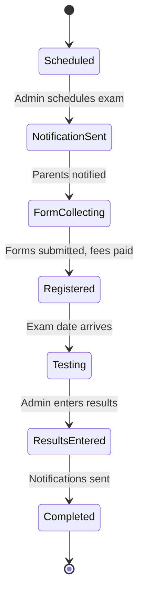

# 11. Feature: 심사 (Belt Promotion)

**Related TRDs**: [03-data-model](./03-data-model.md), [10-payments](./10-payments.md), [12-notifications](./12-notifications.md)  
**Related ADRs**: _None_  
**Phase**: MVP (Phase 1)

---

### Full State Machine

### Scheduling

1. Gym owner visits admin app and clicks "Schedule 심사".
2. Gym owner enters:
   - Exam name (e.g., "Spring 2026 Belt Test")
   - Scheduled date and time
   - Location (optional)
   - Eligible belt levels (checkboxes)
   - Fee per belt level (e.g., White=$50, Yellow=$50, etc.)
3. System creates Simsa record with status=Scheduled.
4. System transitions to NotificationSent state.

### Eligibility Calculation

System identifies eligible members based on:
1. Current belt in eligible_belt_ids.
2. Attendance count since last promotion >= min_required (configurable, default 20).
3. Days since last promotion >= min_time_in_rank (configurable, default 90).

All thresholds configurable per gym in SystemSetting.

### Notification Flow

1. System finds all eligible members.
2. For each eligible member:
   - Fetch parent's preferred language.
   - Fetch NotificationTemplate for "UpcomingSimsa" in that language.
   - Render template with tokens: {{member_name}}, {{belt_level}}, {{simsa_date}}, {{fee}}, {{gym_name}}.
   - Dispatch to configured channels (push, email, SMS).
3. System transitions to FormCollecting state.
4. If forms not submitted within 3 days: auto-send reminder.

### Registration

1. Parent receives notification with exam details and fee.
2. Parent clicks link to exam details page.
3. Parent reviews eligibility and required forms.
4. Parent submits consent form (digital signature).
5. System charges simsa fee via Stripe PaymentIntent.
6. On payment success:
   - Create SimsaRegistration record with status=FeePaid.
   - Send confirmation notification to parent.
7. System transitions to Registered state when all registrations complete.

### Result Entry

1. After exam: admin visits admin app and clicks "Enter 심사 Results".
2. Admin sees list of registered members.
3. For each member: admin selects Pass/Fail and optional score/notes.
4. Admin clicks "Submit Results".
5. System creates SimsaResult record for each member.
6. For each passed member:
   - Auto-update Member.current_belt_id to new belt.
   - Create MemberBelt record with achieved_date = today.
   - Send congratulations notification to parent.
7. For each failed member:
   - Send encouragement notification to parent.
8. System transitions to Completed state.

### Certificate Generation

On pass:
1. System generates PDF certificate from template with:
   - Member name
   - New belt level
   - Exam date
   - Gym name and logo
   - Signature line (for gym owner to sign)
2. PDF stored in S3: `s3://ararat-certs/tenants/{tenantId}/simsa/{resultId}.pdf`.
3. URL stored in SimsaResult.certificate_url.
4. Parent can download/print certificate from app.

### Implementation Notes

> _This section will be updated as the feature is implemented._

- **Module location**: _TBD_
- **Key files**: _TBD_
- **Actual endpoints**: _TBD_
- **Deviations from spec**: _None yet_
- **Edge cases discovered**: _None yet_
- **Configuration**: _TBD_
