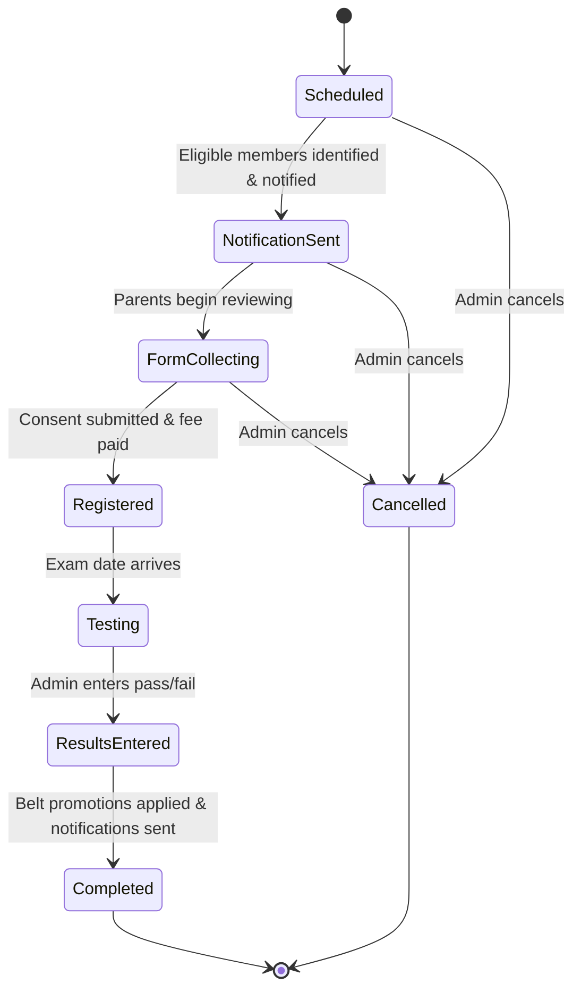

# 12. Feature: 심사 (Belt Promotion)

**Related TRDs**: [03-data-model](./03-data-model.md), [11-payments](./11-payments.md), [13-notifications](./13-notifications.md)  
**Related ADRs**: _None_  
**Phase**: MVP (Phase 1)

---

### Overview

Belt promotion examination system — scheduling, eligibility, registration, testing, result entry, certificate generation. The 심사 lifecycle is fully managed: gym owners schedule exams and define eligibility criteria, the system automatically identifies eligible members and notifies parents, parents register and pay through the app, the admin enters results after the exam, and certificates are generated for passing members.

---

### Business Rules

#### Full State Machine

**Notes**:
- The exam-level state tracks overall exam progress. Individual registrations have their own status (see Registration below).
- Cancellation from any pre-Testing state triggers refunds for paid registrations and cancellation notifications.

#### Scheduling

1. Gym owner navigates to admin 심사 management and clicks "Schedule 심사".
2. Gym owner enters:
   - **Exam name** (e.g., "Spring 2026 Belt Test")
   - **Scheduled date and time**
   - **Location** (optional — defaults to gym address)
   - **Eligible belt levels** (multi-select checkboxes from gym's belt configuration)
   - **Fee per belt level** (e.g., White→Yellow=$50, Green→Blue=$60)
   - **Capacity** (optional — max number of registrants)
   - **Registration deadline** (date — defaults to 3 days before exam)
3. System creates `Simsa` record with `status = Scheduled`.
4. System triggers eligibility calculation and notification dispatch (→ `NotificationSent`).

#### Eligibility Calculation

System identifies eligible members based on **all** of the following criteria:

1. **Belt match**: Member's `current_belt_id` is in the exam's `eligible_belt_ids` list.
2. **Attendance threshold**: Attendance count since last promotion ≥ `min_required_attendance` (configurable per gym in `SystemSetting`, default: **20**).
3. **Time-in-rank**: Days since last promotion ≥ `min_time_in_rank` (configurable per gym in `SystemSetting`, default: **90 days**).
4. **Active membership**: Member's membership status is `Active` (not Suspended, GracePeriod, or Withdrawn).

All thresholds are configurable per gym via `SystemSetting`. Eligibility is recalculated on-demand when parents view the exam detail page (not cached).

**Ineligibility reasons** are returned to the parent app as structured codes:
- `BELT_NOT_ELIGIBLE` — current belt not in exam's eligible levels
- `INSUFFICIENT_ATTENDANCE` — attendance count below threshold (includes current/required counts)
- `INSUFFICIENT_TIME_IN_RANK` — days since last promotion below threshold (includes current/required days)
- `MEMBERSHIP_NOT_ACTIVE` — membership is suspended or in grace period

#### Notification Flow

1. System finds all eligible members for the scheduled exam.
2. For each eligible member:
   - Fetch parent's preferred language (EN/KO/ES).
   - Fetch `NotificationTemplate` for `UpcomingSimsa` in that language.
   - Render template with tokens: `{{member_name}}`, `{{belt_level}}`, `{{simsa_date}}`, `{{fee}}`, `{{gym_name}}`, `{{deadline}}`.
   - Dispatch to configured channels (push, email, SMS) — see [TRD 13: Notifications](./13-notifications.md).
3. System transitions exam to `FormCollecting` state.
4. **3-day reminder**: If registration not submitted within 3 days of initial notification, auto-send reminder via same channels.
5. **Deadline reminder**: 24 hours before registration deadline, send final reminder to un-registered eligible members.

#### Registration

1. Parent receives notification with exam details and registration link.
2. Parent opens exam details in the parent app.
3. Parent reviews eligibility status and exam details for each child.
4. **Multi-step registration flow**:
   - **Step 1**: Select children to register (only eligible children shown as registerable).
   - **Step 2**: Review and submit digital consent form.
   - **Step 3**: Pay exam fee via Stripe `PaymentIntent` — see [TRD 11: Payments](./11-payments.md) for payment processing details.
5. On payment success:
   - Create `SimsaRegistration` record with `status = FeePaid`.
   - Send confirmation notification to parent.
6. Registration statuses per member: `Pending` → `ConsentSubmitted` → `FeePaid` → `Cancelled`.

#### Result Entry

1. After exam date: admin navigates to 심사 detail and enters results.
2. Admin sees table of all registered members.
3. For each member, admin selects:
   - **Result**: Pass or Fail
   - **Notes** (optional): free-text for feedback
4. Admin clicks "Submit Results" — batch operation.
5. System processes results:
   - Creates `SimsaResult` record for each member.
   - **For each passed member**:
     - Auto-update `Member.current_belt_id` to the next belt level.
     - Create `MemberBelt` record with `achieved_date = exam_date`.
     - Trigger congratulations notification to parent.
     - Trigger certificate generation.
   - **For each failed member**:
     - Send encouragement notification to parent with notes (if provided).
6. System transitions exam to `Completed` state.

#### Certificate Generation

On pass:
1. System generates PDF certificate from template with:
   - Member name
   - New belt level and color
   - Exam date
   - Gym name and logo
   - Signature line (for gym owner)
2. PDF stored in S3: `s3://ararat-certs/tenants/{tenantId}/simsa/{resultId}.pdf` — see [TRD 19: File Storage](./19-file-storage.md).
3. URL stored in `SimsaResult.certificate_url`.
4. Parent can view and download certificate from the parent app.

---

### Backend

#### API Endpoints

| Method | Path | Description | Auth |
|--------|------|-------------|------|
| `GET` | `/api/v1/tenants/{tenantId}/simsa` | List exams (filterable by status, date range) | Admin, Parent |
| `POST` | `/api/v1/tenants/{tenantId}/simsa` | Schedule new exam | Admin |
| `GET` | `/api/v1/tenants/{tenantId}/simsa/{id}` | Get exam detail (includes eligibility per member for parents) | Admin, Parent |
| `PATCH` | `/api/v1/tenants/{tenantId}/simsa/{id}` | Update exam (only in Scheduled/NotificationSent state) | Admin |
| `DELETE` | `/api/v1/tenants/{tenantId}/simsa/{id}` | Cancel exam (triggers refunds + notifications) | Admin |
| `GET` | `/api/v1/tenants/{tenantId}/simsa/{id}/registrations` | List registrations for exam | Admin |
| `POST` | `/api/v1/tenants/{tenantId}/simsa/{id}/register` | Register member(s) — accepts consent + triggers payment | Parent, Admin |
| `POST` | `/api/v1/tenants/{tenantId}/simsa/{id}/results` | Submit batch results (pass/fail per member) | Admin |
| `GET` | `/api/v1/tenants/{tenantId}/simsa/{id}/results` | Get results for exam | Admin, Parent |
| `GET` | `/api/v1/tenants/{tenantId}/simsa/{id}/results/{resultId}/certificate` | Download certificate PDF (presigned S3 URL) | Admin, Parent |

**List exams** (`GET /simsa`):
- Parents see only exams relevant to their children (eligible or registered).
- Admins see all exams.
- Query params: `status`, `from_date`, `to_date`, `page`, `limit`.

**Register** (`POST /simsa/{id}/register`):
- Body: `{ member_ids: string[], consent: { signature: string, agreed_at: string } }`
- Returns Stripe `PaymentIntent` client secret for frontend payment completion.
- Admin can register members manually (bypasses payment if `waive_fee: true`).

**Submit results** (`POST /simsa/{id}/results`):
- Body: `{ results: [{ member_id: string, result: "pass" | "fail", notes?: string }] }`
- Idempotent — re-submitting overwrites previous results.
- Triggers belt promotions and notifications asynchronously via job queue.

#### Service Logic

- **SimsaService**: Core service handling exam CRUD, state transitions, and business rule validation.
- **SimsaEligibilityService**: Calculates eligibility per member against exam criteria. Queries attendance records and `MemberBelt` history.
- **SimsaRegistrationService**: Manages registration flow including consent validation and Stripe `PaymentIntent` creation — delegates payment processing to PaymentService (see [TRD 11](./11-payments.md)).
- **SimsaResultService**: Processes batch results, triggers belt promotions (`MemberBelt` creation, `Member.current_belt_id` update), and enqueues notification/certificate jobs.
- **SimsaCertificateService**: Generates PDF certificates from HTML template using a PDF rendering library (e.g., Puppeteer or pdf-lib), uploads to S3, stores URL in `SimsaResult`.

**Job queue** (SQS):
- `simsa.notifications.send` — dispatches eligibility notifications after exam scheduling.
- `simsa.results.process` — processes belt promotions and sends result notifications.
- `simsa.certificate.generate` — generates and uploads PDF certificate per passed member.

---

### Parent/Member App

#### Screen: 심사 Belt Test (`/simsa`)

Displays upcoming and past 심사 exams relevant to the parent's children.

**Upcoming Section**:
- List of scheduled exams with eligibility status **per child**:
  - **Eligible**: green badge, "Register" button enabled.
  - **Not Eligible**: grey badge with reason tooltip (e.g., "Needs 5 more classes", "12 days until eligible").
  - **Registered**: blue badge with "Registered ✓" and payment confirmation.
- Each exam card shows:
  - Exam name, date, location
  - Fee amount
  - Registration deadline
  - Eligible belt levels

**Results Section**:
- Past exams with results per child:
  - Pass: new belt level displayed with congratulations styling, "View Certificate" link.
  - Fail: encouraging message, admin notes (if provided).
- Sorted by date descending.

**Key Components**:
- `ExamCard` — date, location, fee, deadline, status badge
- `EligibilityBadge` — eligible/not-eligible/registered with reason
- `RegistrationButton` — opens multi-step registration flow
- `ResultsTable` — pass/fail results with certificate links

**Data Sources**:
- `useUpcomingSimsa()` — fetches exams with `status` in [Scheduled, NotificationSent, FormCollecting, Registered]
- `useSimsaResults()` — fetches completed exams with results for parent's children
- `useChildren()` — current parent's children with belt info

**Actions**:
- **Register eligible child**: opens multi-step flow (select children → consent form → payment via Stripe Elements)
- **View/download certificate**: opens presigned S3 URL in new tab or triggers download
- **View eligibility requirements**: expands to show attendance count, time-in-rank, and thresholds

#### Screen: Child Detail — Belt Progress Tab (`/children/:id` → Belt Progress tab)

- **Current Belt**: prominently displayed with belt color visualization.
- **Belt Timeline**: chronological list of all belt promotions with:
  - Belt name and color
  - Achievement date
  - 심사 exam name (linked)
  - Certificate download link (if available)
- **Next Eligible 심사**: if an upcoming exam exists and child is eligible, show date and "Register" link. If not eligible, show progress toward eligibility (e.g., "15/20 classes attended", "45/90 days in rank").

---

### Admin App

#### Screen: 심사 Management (`/simsa`)

Main listing of all 심사 exams for the gym.

**Table** (TanStack Table):
| Column | Description |
|--------|-------------|
| Exam Name | Clickable — navigates to detail |
| Date | Exam date, sorted descending by default |
| Belt Levels Tested | Comma-separated belt names |
| Registered / Capacity | e.g., "12 / 20" or "12" if no capacity limit |
| Status | Badge: Scheduled, NotificationSent, FormCollecting, Registered, Testing, ResultsEntered, Completed, Cancelled |

**Data Source**: `useSimsaList()` — paginated, filterable by status and date range.

**Actions**:
- **Schedule New Exam**: opens form dialog with fields: exam name, date/time, location, belt levels (multi-select), fee per level, capacity (optional), registration deadline.
- **Click Row → Detail**: navigates to `/simsa/:id`.
- **Cancel Exam**: confirmation dialog → triggers refunds for paid registrations + cancellation notifications to all registered/notified parents.

#### Screen: 심사 Detail (`/simsa/:id`)

Comprehensive view of a single 심사 exam with all management capabilities.

**Exam Info Section**:
- Date, time, location
- Eligible belt levels with fee per level
- Capacity and current registration count
- Registration deadline
- Status badge with state machine context

**Registered Members Table** (TanStack Table):
| Column | Description |
|--------|-------------|
| Member Name | Student name |
| Current Belt | Belt color + name |
| Testing For | Target belt |
| Eligibility | Met / waived (for manual registrations) |
| Payment Status | Pending / Paid / Waived / Refunded |

**Results Entry** (visible after exam date — `status` ≥ Testing):
- Batch form: table of registered members with Pass/Fail radio buttons and notes text field per row.
- "Submit Results" button — processes all results in single batch.
- After submission: results table replaces entry form, showing pass/fail with new belt levels for passed members.

**Key Components**:
- `ExamInfoCard` — read-only exam details with edit button (pre-Testing states only)
- `RegistrationsTable` — TanStack Table with registration details
- `BatchResultEntryForm` — pass/fail radio + notes per member, submit button
- `ResultsTable` — finalized results with belt changes
- `SendResultsButton` — triggers result notifications to all parents
- `GenerateCertificatesButton` — batch-generates certificates for all passed members

**Data Sources**:
- `useSimsa(id)` — exam detail with status
- `useSimsaRegistrations(id)` — registered members with payment status
- `useSimsaResults(id)` — results after entry

**Actions**:
- **Edit exam**: modify exam details (only in Scheduled/NotificationSent state)
- **View registrations**: see all registered members with eligibility and payment info
- **Register members manually**: admin can add members directly (optionally waiving fee)
- **Enter batch results**: pass/fail per member with notes — triggers belt promotions + notifications
- **Send results**: dispatches result notifications to all parents
- **Generate/send certificates**: batch-generate PDFs for passed members, notify parents
- **Export to PDF**: export registrations list or results as PDF report

---

### Service Dependencies

#### Services This Feature Consumes
| Service | Repo | Endpoint | Method | Request Shape | Response Shape |
|---------|------|----------|--------|---------------|----------------|
| Notification Service | Internal (TRD 13) | 심사 announcements, registration confirmations, result notifications | Internal call | `{ recipientId, templateId, data }` | `{ notificationId }` |
| Payment Service | Internal (TRD 11) | 심사 fee processing | Internal call | `{ memberId, amount, type: "simsa" }` | `{ paymentId }` |
| File Service | Internal (TRD 19) | Certificate PDF storage | Internal call | `{ file, category: "simsa_certificate" }` | `{ fileId, url }` |

#### Contracts This Feature Exposes
| Endpoint | Method | Consumer(s) | Request Shape | Response Shape |
|----------|--------|-------------|---------------|----------------|
| `/api/v1/tenants/{tenantId}/simsa` | GET/POST/PATCH | Admin App | 심사 event config JSON | 심사 list or detail |
| `/api/v1/tenants/{tenantId}/simsa/{id}/registrations` | GET/POST | Admin App, Parent App | Registration data JSON | Registration list or detail |
| `/api/v1/tenants/{tenantId}/simsa/{id}/results` | GET/POST | Admin App, Parent App | Result data JSON | Result list or detail |
| `/api/v1/tenants/{tenantId}/simsa/{id}/eligibility` | GET | Admin App, Parent App | `?memberId=` | Eligibility check result |

---

## Phase 2 Features (Not Yet Specified)

The following features are identified in the PRD for Phase 2 and will be fully specified before implementation:

### Kukkiwon TCON Data Export
- **Use case**: Export 심사 results in Kukkiwon TCON system format for official 승품/단 certification submission
- **Export format**: CSV or XML matching TCON import schema (member name, DOB, current rank, test date, result)
- **Admin flow**: Select completed 심사 → Export for TCON → download file → manually upload to TCON portal
- **Data mapping**: Map Ararat belt levels to Kukkiwon 급/품/단 codes

### Kukkiwon Certification Tracking
- **Use case**: Track official Kukkiwon certification numbers and issuance dates for each member
- **Data fields**: Kukkiwon certificate number, issue date, expiry date (if applicable), rank certified
- **Admin entry**: Manual entry in member profile after receiving physical certificate from Kukkiwon
- **Parent view**: Certification status visible in member profile on Parent App
- **Reporting**: Certification tracking report — members pending certification, certified members list

### Implementation Notes

> _This section will be updated as the feature is implemented._

- **Module location**: _TBD_
- **Key files**: _TBD_
- **Actual endpoints**: _TBD_
- **Deviations from spec**: _None yet_
- **Edge cases discovered**: _None yet_
- **Configuration**: _TBD_
