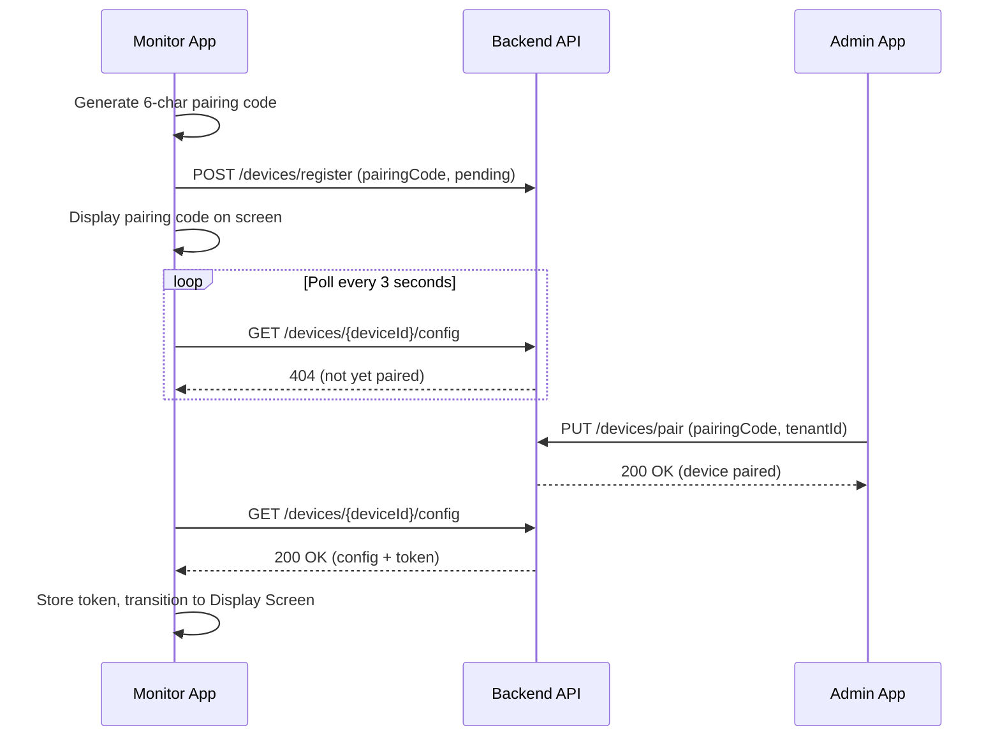

# 18. Feature: Monitor App (TV Display)

**Related TRDs**: [10-attendance](./10-attendance.md), [07-web-frontend-architecture](./07-web-frontend-architecture.md)  
**Related ADRs**: [ADR-012](./adr/012-react-vite-frontend.md)  
**Phase**: Phase 2

---

## Overview

Fullscreen web application designed for TV or large display mounted in the gym lobby. Shows live class schedule, real-time attendance feed, and rotating announcements. The app requires no user interaction during normal operation — all content is managed via the Admin App. It auto-recovers from connection loss and displays last-known data while reconnecting.

Deployment targets: smart TV browser, Chromecast, Amazon Fire Stick, or any HDMI stick with a web browser in kiosk/fullscreen mode.

---

## Business Rules

- Web app runs in fullscreen browser mode on a large display (TV, projector, or monitor)
- Polls backend every **30 seconds** for schedule, live attendance, and announcements
- **No user interaction** during normal operation — display-only
- Content managed entirely via Admin App → Settings → Kiosk/Monitor Configuration
- **Authentication** uses one of two methods:
  - **URL token**: `?token=<jwt>` containing `tenant_id` and read-only scope — suitable for quick setup
  - **Device registration**: Admin registers the display device via pairing code; system issues a long-lived device token — recommended for permanent installations
- **Auto-recovery**: On network loss, show "Connecting..." overlay, retry every 5 seconds, and continue displaying last-known data with a stale-data indicator
- Target resolutions: **1920×1080** (Full HD) and **1280×720** (HD)
- Fixed landscape orientation; no main-page scrolling (attendance feed auto-scrolls internally)
- If viewport is too small (below 1280×720): display "Please use a larger display" message

---

## Backend

### API Endpoints

| Method | Path | Description | Auth |
|--------|------|-------------|------|
| `GET` | `/api/v1/tenants/{tenantId}/monitor/schedule` | Today's class schedule | Device token or URL token |
| `GET` | `/api/v1/tenants/{tenantId}/monitor/attendance` | Today's live attendance feed | Device token or URL token |
| `GET` | `/api/v1/tenants/{tenantId}/monitor/announcements` | Active announcements for display | Device token or URL token |
| `POST` | `/api/v1/devices/register` | Register a new display device (returns device token) | Admin JWT |
| `GET` | `/api/v1/devices/{deviceId}/config` | Get display configuration for a registered device | Device token |

#### `GET /monitor/schedule`

Returns today's classes for the tenant, ordered by start time.

```json
{
  "date": "2026-03-01",
  "classes": [
    {
      "id": "cls_abc123",
      "name": "Little Tigers",
      "startTime": "16:00",
      "endTime": "16:45",
      "instructor": "Master Kim",
      "currentCount": 12,
      "maxCapacity": 20,
      "status": "in_progress"
    },
    {
      "id": "cls_def456",
      "name": "Junior Warriors",
      "startTime": "17:00",
      "endTime": "17:50",
      "instructor": "Sabeom Lee",
      "currentCount": 0,
      "maxCapacity": 25,
      "status": "upcoming"
    }
  ]
}
```

- `status` values: `completed`, `in_progress`, `upcoming`
- Current class (`in_progress`) is highlighted on the display
- Next upcoming class is marked "Up Next"

#### `GET /monitor/attendance`

Returns today's check-ins sorted by most recent first.

```json
{
  "date": "2026-03-01",
  "totalCount": 34,
  "entries": [
    {
      "memberId": "mem_xyz",
      "memberName": "Sophia Park",
      "photoUrl": "/avatars/mem_xyz_thumb.jpg",
      "checkInTime": "2026-03-01T16:32:00Z",
      "className": "Little Tigers"
    }
  ]
}
```

- Returns up to 50 most recent entries (display auto-scrolls through them)
- `photoUrl` is a thumbnail avatar; falls back to initials if null

#### `GET /monitor/announcements`

Returns active announcements targeted at the monitor display.

```json
{
  "announcements": [
    {
      "id": "ann_001",
      "type": "simsa",
      "title": "Belt Promotion Exam — March 15",
      "body": "Registration deadline: March 10",
      "priority": "high"
    },
    {
      "type": "birthday",
      "title": "🎂 Happy Birthday!",
      "body": "Sophia Park, Daniel Kim"
    },
    {
      "type": "promotion",
      "title": "Congratulations!",
      "body": "Ethan Lee — Yellow Belt 🥋"
    },
    {
      "type": "closure",
      "title": "Gym Closed — March 20",
      "body": "Spring break holiday"
    }
  ]
}
```

- Announcement types: `simsa`, `event`, `closure`, `birthday`, `promotion`, `general`
- Ordered by priority (high → normal → low), then by creation date

#### `POST /devices/register`

Called by Admin App to initiate device pairing.

```json
// Request
{
  "pairingCode": "A3X7K9",
  "tenantId": "ten_abc",
  "deviceName": "Lobby TV",
  "deviceType": "monitor"
}

// Response
{
  "deviceId": "dev_123",
  "deviceToken": "eyJ...",
  "tokenExpiresAt": "2027-03-01T00:00:00Z"
}
```

- Pairing code is 6 alphanumeric characters, valid for 10 minutes
- Device token is long-lived (default: 1 year), renewable
- `deviceType`: `monitor` or `kiosk`

#### `GET /devices/{deviceId}/config`

Returns display configuration set by the admin.

```json
{
  "deviceId": "dev_123",
  "tenantId": "ten_abc",
  "deviceName": "Lobby TV",
  "displayConfig": {
    "theme": "dark",
    "showAttendance": true,
    "showSchedule": true,
    "showAnnouncements": true,
    "announcementCycleSec": 10,
    "pollIntervalSec": 30,
    "locale": "en"
  }
}
```

---

## Monitor App

The Monitor App is a standalone React + Vite application following the patterns defined in [07-web-frontend-architecture](./07-web-frontend-architecture.md). It has exactly two routes.

### Display Screen (`/`)

The primary fullscreen display shown during normal operation.

#### Layout

Fullscreen split-screen with four zones:

```
┌─────────────────────────────────────────────────────────┐
│                   TOP BANNER (full width)                │
│         Rotating announcements — 10-second cycle         │
├───────────────────────────────┬─────────────────────────┤
│                               │                         │
│       LEFT PANEL (60%)        │    RIGHT PANEL (40%)    │
│                               │                         │
│     Today's Class Schedule    │  Live Attendance Feed   │
│                               │                         │
│   • Class name                │  • Auto-scrolling list  │
│   • Time range                │  • Member avatar        │
│   • Instructor                │  • Member name          │
│   • Current / max capacity    │  • Check-in time        │
│   • Current class highlighted │  • New entries animate   │
│   • Next class: "Up Next"     │    in from top          │
│                               │                         │
├───────────────────────────────┴─────────────────────────┤
│                   BOTTOM BAR (full width)                │
│    Current date/time  |  Gym name  |  Connection ●      │
└─────────────────────────────────────────────────────────┘
```

#### Left Panel — Class Schedule (60%)

- Lists all classes for today, ordered by start time
- Each row shows: class name, time range (e.g., "4:00 – 4:45 PM"), instructor name, enrollment (e.g., "12 / 20")
- **Current class** (`in_progress`): highlighted with accent background color
- **Next upcoming class**: labeled with "Up Next" badge
- **Completed classes**: dimmed/muted styling
- If no classes today: "No classes scheduled today" centered message

#### Right Panel — Attendance Feed (40%)

- Scrolling list of checked-in members, most recent first
- Each entry: member photo (circular avatar, 48px), member name, check-in time (e.g., "4:32 PM")
- **New check-ins** animate in from the top with a slide-down + fade-in transition (300ms ease)
- Auto-scrolls to show recent entries; pauses scroll if list fits without overflow
- Falls back to initials avatar (first letter of first + last name) when no photo available
- If no check-ins yet: "No check-ins yet today" placeholder

#### Top Banner — Announcements

- Full-width banner rotating through active announcements
- **Cycle time**: 10 seconds per announcement (configurable via device config)
- Announcement types with visual treatment:
  - `simsa`: 🥋 icon, accent color
  - `birthday`: 🎂 icon, warm color
  - `promotion`: 🏆 icon, gold/yellow color
  - `closure`: ⚠️ icon, warning color
  - `event` / `general`: 📢 icon, neutral color
- Smooth crossfade transition between announcements (500ms)
- If no announcements: banner shows gym name / logo

#### Bottom Bar

- **Left**: Current date and time, updating every second (e.g., "Sunday, March 1, 2026 — 4:32 PM")
- **Center**: Gym name
- **Right**: Connection status indicator
  - 🟢 Green dot: connected, data fresh
  - 🟠 Orange dot: data stale (last successful fetch > 60 seconds ago)
  - 🔴 Red dot: disconnected, retrying

#### Key Components

| Component | Purpose |
|-----------|---------|
| `MonitorLayout` | Root fullscreen layout with four zones |
| `SchedulePanel` | Left panel — renders class schedule list |
| `ScheduleRow` | Individual class row with status styling |
| `AttendanceFeed` | Right panel — auto-scrolling attendance list |
| `AttendanceEntry` | Individual check-in entry with avatar and animation |
| `AnnouncementCarousel` | Top banner — rotating announcements |
| `StatusBar` | Bottom bar — clock, gym name, connection indicator |
| `ConnectionBadge` | Green/orange/red dot with label |
| `StaleDataOverlay` | Semi-transparent overlay when reconnecting |

#### Data Sources

All queries use React Query (TanStack Query) with automatic polling:

| Hook | Endpoint | `refetchInterval` |
|------|----------|--------------------|
| `useScheduleToday()` | `GET /monitor/schedule` | `30000` (30s) |
| `useTodayAttendance()` | `GET /monitor/attendance` | `30000` (30s) |
| `useAnnouncements()` | `GET /monitor/announcements` | `30000` (30s) |
| `useDeviceConfig()` | `GET /devices/{deviceId}/config` | `300000` (5min) |

- All hooks retain previous data on error (`keepPreviousData: true`) so the display never goes blank
- Poll interval is configurable via device config (`pollIntervalSec`)

#### Display Constraints

- **Target resolutions**: 1920×1080 (Full HD), 1280×720 (HD)
- **Orientation**: Fixed landscape only
- **Positioning**: Absolute / CSS Grid — no scrolling on the main layout
- **Fonts**: Large, high-contrast for readability from across the room (schedule text ≥ 24px, attendance text ≥ 20px, announcements ≥ 28px)
- **Theme**: Dark theme default (better for TV displays), configurable to light via device config
- **Minimum viewport**: If width < 1280px or height < 720px, display full-screen message: "Please use a larger display (minimum 1280×720)"

---

### Setup Screen (`/setup`)

Shown on first launch or when the device token is missing/expired/invalid.

#### Flow



#### UI Elements

- **Pairing code**: Displayed large and centered (≥ 120px font, monospace, letter-spaced)
  - Format: 6 alphanumeric characters, grouped as `XXX-XXX` for readability
  - Example: `A3X-7K9`
- **Instructions text**: "Enter this code in Admin App → Settings → Kiosk/Monitor Configuration"
- **Loading state**: Spinner with "Waiting for admin to enter code..."
- **Success state**: Checkmark animation + "Device paired! Loading display..." (auto-transitions after 2s)
- **Error states**:
  - Code expired (10 min): "Code expired" message + "Generate New Code" button
  - Network error: "Unable to reach server. Retrying..." with retry countdown
- **"Generate New Code" button**: Only interactive element on this screen; generates a fresh pairing code

#### Key Components

| Component | Purpose |
|-----------|---------|
| `SetupScreen` | Full-screen setup/pairing view |
| `PairingCodeDisplay` | Large centered pairing code |
| `SetupInstructions` | Instructional text for admin |
| `SetupStatus` | Loading spinner / success / error feedback |

#### Data Source

| Hook | Description | Interval |
|------|-------------|----------|
| `useDeviceRegistration(pairingCode)` | Polls pairing status until paired | `3000` (3s) |

- On successful pairing: stores device token in `localStorage`, navigates to `/`
- On code expiration: stops polling, shows "Generate New Code" button

---

## Auto-Recovery

The Monitor App must run unattended for days or weeks. Robust recovery is critical.

### Network Loss

1. On failed fetch: show semi-transparent "Connecting..." overlay on top of existing content
2. Continue displaying last-known data (schedule, attendance, announcements) from React Query cache
3. Show stale-data indicator: orange connection dot + "Last updated: X min ago" in bottom bar
4. Retry every **5 seconds** (separate from the 30s poll cycle)
5. On successful reconnect: dismiss overlay, refresh all data immediately, restore green connection dot

### Token Expiration

1. If any API call returns `401 Unauthorized`: clear stored token
2. Navigate to `/setup` screen to re-pair the device
3. Previously cached data is discarded

### Browser Crash / Restart

- Include `<meta http-equiv="refresh" content="300">` as a fallback — reloads page every 5 minutes if JS is unresponsive
- On page load: check for valid device token in `localStorage`
  - Valid token → go to Display Screen, fetch fresh data
  - No token / expired → go to Setup Screen
- Optional: register a service worker for offline caching of the app shell

### Error Boundary

- Wrap the entire app in a React error boundary
- On unhandled error: display "Display error — reloading..." message, auto-reload after 5 seconds
- Log errors to backend (best-effort, non-blocking)

---

## Implementation Notes

> _This section will be updated as the feature is implemented._

- **Module location**: _TBD_
- **Key files**: _TBD_
- **Actual endpoints**: _TBD_
- **Deviations from spec**: _None yet_
- **Edge cases discovered**: _None yet_
- **Configuration**: _TBD_
