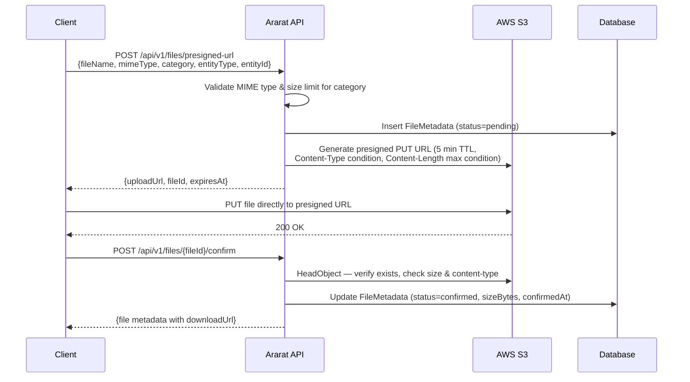

# 19. File & Media Storage

**Related TRDs**: [05-api-design](./05-api-design.md), [09-registration](./09-registration.md), [14-newsletter](./14-newsletter.md), [15-parent-feed](./15-parent-feed.md), [20-security-compliance](./20-security-compliance.md)  
**Related ADRs**: [ADR-013](./adr/013-aws-cloud-platform.md), [ADR-011](./adr/011-nestjs-backend.md)  
**Phase**: MVP (Phase 1)

---

## Overview

Centralized file storage service for all binary assets in Ararat — profile photos, activity feed photos, newsletter attachments, 심사 certificates, and general documents. Files are stored in AWS S3, served via CloudFront CDN, and uploaded directly from clients using presigned URLs to avoid routing binary data through the API server.

All files are tenant-scoped. The tenant ID is embedded in every S3 key path, ensuring complete data isolation.

---

## FileMetadata Entity

```
FileMetadata:
  - id (UUID, PK)
  - tenant_id (UUID, FK → Tenant, NOT NULL)
  - original_name (VARCHAR 255 — original filename from client)
  - storage_path (VARCHAR 500 — full S3 key, e.g. "{tenantId}/profile_photo/2026/03/abc123.jpg")
  - mime_type (VARCHAR 100 — e.g. "image/jpeg", "application/pdf")
  - size_bytes (BIGINT — actual file size after upload confirmation)
  - category (ENUM: profile_photo, newsletter_attachment, feed_photo, simsa_certificate, document)
  - uploaded_by (UUID, FK → User, NOT NULL)
  - entity_type (VARCHAR 50 — e.g. "member", "newsletter", "feed_post", "simsa_result")
  - entity_id (UUID — ID of the owning entity)
  - status (ENUM: pending, confirmed, deleted — default: pending)
  - is_public (BOOLEAN, default false — controls whether unsigned CDN URL is allowed)
  - created_at (TIMESTAMPTZ — when presigned URL was requested)
  - confirmed_at (TIMESTAMPTZ, nullable — when upload was confirmed)
  - deleted_at (TIMESTAMPTZ, nullable — soft-delete timestamp)
```

**Indexes**: `(tenant_id, entity_type, entity_id)` for listing files by owner entity. `(status, created_at)` for orphan cleanup queries.

---

## S3 Bucket Configuration

- **Bucket name**: `ararat-{env}-files` (e.g. `ararat-prod-files`, `ararat-staging-files`)
- **Region**: `us-east-1` (same region as ECS deployment)
- **Versioning**: Disabled (soft-delete in DB provides recoverability)
- **Encryption**: SSE-S3 (AES-256) server-side encryption enabled by default
- **Public access**: Blocked — all public access settings disabled. Access only via CloudFront OAI or presigned URLs.
- **Lifecycle rules**: Objects tagged `gc=true` are permanently deleted after 1 day (used by retention cron after marking for deletion)

### Key Path Pattern

```
{tenantId}/{category}/{YYYY}/{MM}/{uuid}.{ext}
```

Examples:
- `t_abc123/profile_photo/2026/03/f_def456.jpg`
- `t_abc123/newsletter_attachment/2026/03/f_ghi789.pdf`
- `t_abc123/feed_photo/2026/03/f_jkl012.png`
- `t_abc123/simsa_certificate/2026/03/f_mno345.pdf`

The date-partitioned structure enables efficient lifecycle management and S3 listing operations.

---

## CloudFront CDN Configuration

- **Distribution**: Single CloudFront distribution in front of the S3 bucket
- **Origin**: S3 bucket with Origin Access Identity (OAI) — direct S3 access is blocked; only CloudFront can read objects
- **Domain**: `cdn.ararat.app` (custom CNAME with ACM SSL certificate)
- **Private files** (default): Served via CloudFront signed URLs with 24-hour TTL. Signed URLs use a CloudFront key pair managed in AWS Secrets Manager.
- **Public files** (`is_public = true`): Served via unsigned CloudFront URLs. Used for profile photos when shared in contexts that don't support auth headers (e.g., avatar images in emails).
- **Cache behavior**: `Cache-Control: max-age=86400` (1 day) for all files. Immutable content (files never change once uploaded — edits create new files).
- **Error pages**: 403/404 responses return a minimal JSON `{"error": "NOT_FOUND"}` instead of default XML.

---

## Upload Constraints

| Category | Max Size | Allowed MIME Types |
|----------|----------|--------------------|
| `profile_photo` | 5 MB | `image/jpeg`, `image/png`, `image/webp` |
| `newsletter_attachment` | 10 MB | `image/jpeg`, `image/png`, `application/pdf`, `application/vnd.openxmlformats-officedocument.wordprocessingml.document` |
| `feed_photo` | 10 MB | `image/jpeg`, `image/png`, `image/webp` |
| `simsa_certificate` | 5 MB | `application/pdf`, `image/png` |
| `document` | 20 MB | `application/pdf`, `application/vnd.openxmlformats-officedocument.wordprocessingml.document`, `application/vnd.openxmlformats-officedocument.spreadsheetml.sheet` |

Constraints are validated **twice**: once when the presigned URL is requested (reject disallowed MIME types and set `Content-Length` condition on the presigned URL), and again during upload confirmation (verify actual object size and content type via `HeadObject`).

---

## Presigned URL Upload Flow



**Key design decisions**:
- Files are uploaded directly to S3 from the client, never proxied through the API server — reduces API server CPU/memory pressure and enables large file uploads without timeout concerns.
- The `pending` → `confirmed` two-step flow allows the API to verify the upload actually succeeded and record the true file size.
- Presigned URLs expire after 5 minutes. If the client does not complete the upload in time, the FileMetadata record remains in `pending` status and is cleaned up by the orphan retention cron.

Future consideration: ClamAV integration via S3 event trigger for virus scanning on upload.

---

## API Endpoints

All endpoints follow [TRD 05](./05-api-design.md) response envelope conventions. Tenant context is derived from the authenticated user's JWT (not in URL path for file endpoints).

### POST `/api/v1/files/presigned-url`

Request a presigned S3 upload URL.

**Auth**: Any authenticated user  
**Request**:
```json
{
  "fileName": "photo.jpg",
  "mimeType": "image/jpeg",
  "category": "profile_photo",
  "entityType": "member",
  "entityId": "550e8400-e29b-41d4-a716-446655440000"
}
```

**Response** (201 Created):
```json
{
  "data": {
    "fileId": "660e8400-e29b-41d4-a716-446655440001",
    "uploadUrl": "https://ararat-prod-files.s3.amazonaws.com/...?X-Amz-Signature=...",
    "expiresAt": "2026-03-01T12:05:00Z"
  },
  "meta": {
    "timestamp": "2026-03-01T12:00:00Z",
    "version": "1.0"
  }
}
```

**Errors**: `VALIDATION_ERROR` (400) if MIME type not allowed for category or fileName is empty.

### POST `/api/v1/files/:id/confirm`

Confirm that a file upload completed successfully. The API verifies the object exists in S3.

**Auth**: File uploader (uploaded_by must match current user)  
**Request**: Empty body  
**Response** (200 OK):
```json
{
  "data": {
    "id": "660e8400-e29b-41d4-a716-446655440001",
    "originalName": "photo.jpg",
    "mimeType": "image/jpeg",
    "sizeBytes": 2048576,
    "category": "profile_photo",
    "status": "confirmed",
    "downloadUrl": "https://cdn.ararat.app/t_abc123/profile_photo/2026/03/f_660e8400.jpg?Signature=...",
    "expiresAt": "2026-03-02T12:00:00Z",
    "createdAt": "2026-03-01T12:00:00Z",
    "confirmedAt": "2026-03-01T12:00:30Z"
  },
  "meta": { "timestamp": "2026-03-01T12:00:30Z", "version": "1.0" }
}
```

**Errors**: `NOT_FOUND` (404) if fileId not found or not owned by user. `CONFLICT` (409) if already confirmed. `VALIDATION_ERROR` (400) if S3 object does not exist or exceeds category size limit.

### GET `/api/v1/files/:id`

Returns file metadata with a signed download URL.

**Auth**: File uploader, or any user with access to the parent entity  
**Response** (200 OK):
```json
{
  "data": {
    "id": "660e8400-e29b-41d4-a716-446655440001",
    "originalName": "photo.jpg",
    "mimeType": "image/jpeg",
    "sizeBytes": 2048576,
    "category": "profile_photo",
    "entityType": "member",
    "entityId": "550e8400-e29b-41d4-a716-446655440000",
    "status": "confirmed",
    "isPublic": false,
    "downloadUrl": "https://cdn.ararat.app/t_abc123/profile_photo/2026/03/f_660e8400.jpg?Signature=...",
    "expiresAt": "2026-03-02T12:00:00Z",
    "createdAt": "2026-03-01T12:00:00Z",
    "confirmedAt": "2026-03-01T12:00:30Z"
  },
  "meta": { "timestamp": "2026-03-01T12:00:35Z", "version": "1.0" }
}
```

**Notes**: `downloadUrl` is a CloudFront signed URL (24h TTL) for private files, or an unsigned CloudFront URL for public files. Only `confirmed` files return a download URL; `pending` files return `downloadUrl: null`.

### DELETE `/api/v1/files/:id`

Soft-deletes a file. Sets `status=deleted` and `deleted_at=NOW()`. The S3 object is retained until the retention cron permanently purges it.

**Auth**: File uploader, Admin, Owner  
**Response**: `204 No Content`  
**Errors**: `NOT_FOUND` (404) if file not found or already deleted.

### GET `/api/v1/files?entityType=X&entityId=Y`

List files associated with an entity. Cursor-paginated per [TRD 05](./05-api-design.md).

**Auth**: Any user with access to the parent entity  
**Query params**: `entityType` (required), `entityId` (required), `category` (optional filter), `limit` (default 20, max 100), `cursor` (opaque pagination token)  
**Response** (200 OK):
```json
{
  "data": [
    {
      "id": "660e8400-e29b-41d4-a716-446655440001",
      "originalName": "photo.jpg",
      "mimeType": "image/jpeg",
      "sizeBytes": 2048576,
      "category": "profile_photo",
      "downloadUrl": "https://cdn.ararat.app/...",
      "expiresAt": "2026-03-02T12:00:00Z",
      "createdAt": "2026-03-01T12:00:00Z"
    }
  ],
  "meta": {
    "timestamp": "2026-03-01T12:01:00Z",
    "version": "1.0",
    "pagination": {
      "cursor": "eyJpZCI6IjY2MGU4NDAw...",
      "limit": 20,
      "has_more": false
    }
  }
}
```

---

## Retention Policy

### Soft-Delete Purge

Files with `status=deleted` are permanently purged (S3 object deleted, DB row hard-deleted) **30 days** after `deleted_at`.

### Orphan Cleanup

Files with `status=pending` that were never confirmed are cleaned up **24 hours** after `created_at`. This handles cases where a presigned URL was issued but the client never completed the upload, or the upload succeeded but the client never called confirm.

### Cron Job

A single NestJS cron job handles both retention tasks:

- **Schedule**: Daily at 3:00 AM UTC (`@Cron('0 3 * * *')`)
- **Soft-delete purge**: `DELETE FROM file_metadata WHERE status = 'deleted' AND deleted_at < NOW() - INTERVAL '30 days'`. For each row, delete the S3 object first (`DeleteObject`), then hard-delete the DB row.
- **Orphan cleanup**: `DELETE FROM file_metadata WHERE status = 'pending' AND created_at < NOW() - INTERVAL '24 hours'`. For each row, attempt `DeleteObject` (ignore if object doesn't exist), then hard-delete the DB row.
- **Batch size**: Process 100 records per iteration to avoid long-running transactions. Loop until no more qualifying records.
- **Logging**: Log count of purged and orphaned files per run.

---

## Service Dependencies

### Services This Feature Consumes

| Service | Repo | Endpoint / API | Method | Request Shape | Response Shape |
|---------|------|----------------|--------|---------------|----------------|
| AWS S3 | — | `PutObject` (presigned) | PUT | Binary file body with Content-Type, Content-Length | 200 OK |
| AWS S3 | — | `HeadObject` | HEAD | Bucket + Key | Content-Length, Content-Type, ETag |
| AWS S3 | — | `GetObject` (presigned) | GET | Bucket + Key | Binary file body |
| AWS S3 | — | `DeleteObject` | DELETE | Bucket + Key | 204 No Content |
| AWS CloudFront | — | `getSignedUrl` (SDK) | — | URL + Key pair ID + private key + expiry | Signed URL string |

### Contracts This Feature Exposes

| Endpoint | Method | Consumer(s) | Request Shape | Response Shape |
|----------|--------|-------------|---------------|----------------|
| `/api/v1/files/presigned-url` | POST | Registration (profile photos), Newsletter (attachments), Parent Feed (activity photos), 심사 (certificates) | `{fileName, mimeType, category, entityType, entityId}` | `{fileId, uploadUrl, expiresAt}` |
| `/api/v1/files/:id/confirm` | POST | All file uploaders | Empty body | File metadata with downloadUrl |
| `/api/v1/files/:id` | GET | Any feature displaying files | — | File metadata with signed downloadUrl |
| `/api/v1/files/:id` | DELETE | Registration (photo removal), Admin tools | — | 204 No Content |
| `/api/v1/files` | GET | Newsletter (list attachments), Parent Feed (list photos), Member detail (list photos) | `?entityType&entityId` | Paginated file metadata list |

---

## Implementation Notes

> Last verified: _Not yet implemented_

- **Module location**: _Not yet implemented_
- **Key files**: _Not yet implemented_
- **Actual endpoints**: _Not yet implemented_
- **Deviations from spec**: _None yet_
- **Edge cases discovered**: _None yet_
- **Configuration**: _Not yet implemented_
